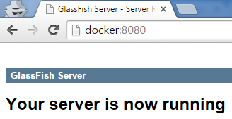
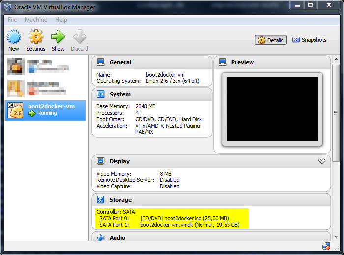
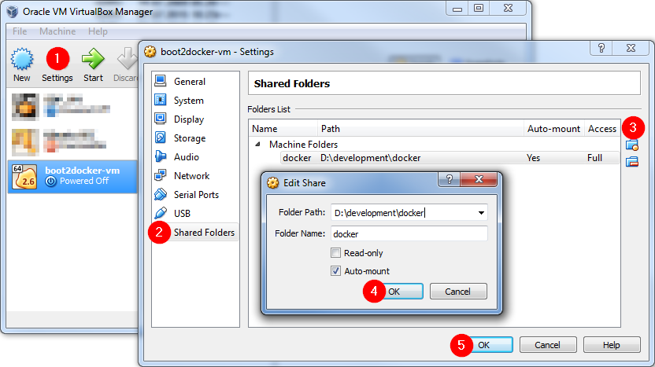

**UPDATED**: Docker deprecates the Boot2Docker command line in favor of Docker Machine. All Tips and Tricks were updated to reflect this change.

## Edit etc/hosts

Your Docker host on Windows is usually accessible either on the IP address 192.168.59.103 (older Docker versions) or 192.168.99.101 (newer Docker versions). As you can see, not so easy to remember.

You can add a new record to your etc/hosts file (in Windows) to create a local DNS name for your Docker VM (Boot2Docker), e.g.:

```bash
192.168.59.103 docker
192.168.99.101 docker
```

which makes your life easier, see Figure 1.



**NOTE**: If you do not know, how to add a new record to your etc/hosts file, check this [tutorial](http://www.rackspace.com/knowledge_center/article/how-do-i-modify-my-hosts-file).

## Configure your Docker Machine (old Boot2Docker) inside Virtual Box

The installation process of Docker on Windows automatically creates a new lightweight virtual machine (VM of [Boot2Docker](http://boot2docker.io/)) inside VirtualBox. If you do not know what I mean, visit my another [post about Docker architecture on Windows](http://blog.pavelsklenar.com/docker-confusing-installation-windows/) first.

The used VirtualBox is completely hidden behind Docker Machine API and you usually do not need to know anymore.

Sometimes you need more e.g.:

- Allocate more memory or CPUs to your VM,
- change a network connectivity either to your Windows or to the internet,
- raw backup your containers,
- or simply know where all data related to containers are saved.

Basically, you have two options.

1. You can use the `boot2docker config` command to generate a configuration file which you can edit and set a lot of parameters related to the VM with Boot2Docker - no more available via Docker Machine.
2. The Docker VM is a normal VM created inside VirtualBox and you are able to change all its settings in the Oracle VM VirtualBox Manager (as I said, memory, CPUs, Network, Storages etc.), see Figure 2.



##  Access Windows directories directly from any Docker container

Users on Windows have one more virtualization layer (VirtualBox) between their running containers inside Docker VM (Boot2Docker) and Windows. So you cannot simply mount your Windows directory to your container inside Docker.

The required setting consists of two steps:

- Mount a Windows directory as a folder inside Docker VM
- Mount that folder to any container

### Mount a Windows directory as a folder inside Docker VM

At first you need to create a new Shared Folder in the Virtual Box setting. See Figure 3.



Then you need to mount this folder inside Docker VM with this command:

```bash
$ mount -t vboxsf -o uid=1000,gid=50 your-shared-folder-name /existing/location/in/docker/VM
```

In our case, the command looks like this:

```bash
$ mount -t vboxsf -o uid=1000,gid=50 docker /home/docker/data
```

**NOTE**: The `data` folder needs to exist before any mounting, i.e. call before: `mkdir -p /home/docker/data.`

**TIP**: If you add this mount command to a profile file (see the following trick), your Windows directories will be accessible automatically after startup inside of your Docker VM.

### Mount that folder to any container

This task could be done with a standard volume parameter `-v` from the `docker run` command.

```bash
docker run -it -v /home/docker/data:/data ubuntu bash
```

Now my Windows directory (D:\\development\\docker) is accessible directly inside a new ubuntu container.

## Permanent changes inside Docker VM

The Docker VM itself is a read-only image used to boot your VM. All permanent data are stored in a Virtual Machine Disk connected and mounted to your VM (see Figure 1 and the yellow box).

Basically, there are two main folders:

```bash
/mnt/sda1/var/lib/boot2docker /mnt/sda1/var/lib/docker
```

The first one contains permanent data related to Docker VM (e.g. a configuration of docker's profile, ssh setting etc.)

The second one is related to your downloaded/created images, containers etc.

The `boot2docker` folder contains a specific file with name `profile` where you can add new entries to be run immediately after any system boot before the daemon starts, e.g.:

```bash
export HTTP_PROXY=http://ip:port
export HTTPS_PROXY=http://ip:port 
mkdir -p /home/docker/data 
mount -t vboxsf -o uid=1000,gid=50 docker /home/docker/data
```

## Connect to Docker VM via SSH

You have two options how to control your Docker on Windows:

- [Using a Windows Docker client](https://docs.docker.com/installation/windows/), i.e. using a Windows Command Line Prompt (`cmd.exe`) or using PowerShell (`powershell.exe`),
- using a native Docker client inside your Docker VM.

I prefer the second option because I used to use a Linux shell.

### How to connect to your Docker VM with SSH?

Your Docker VM is listening on port 22, so you can directly connect to your running VM via SSH (using username: `docker`, password: `tcuser`).

If you want to use your public key without any password entry, add your public key to `.ssh/authorized_keys`.

**NOTE**: You should not edit directly this file inside docker's home folder (`/home/docker/.ssh/authorized_keys`). The whole docker's home folder is not saved on the permanent storage and will be deleted during a next restart.

Instead of that, edit `authorized_keys` file inside an existing archive `userdata.tar` (located in `/mnt/sda1/var/lib/boot2docker/`) which will be automatically untared into docker's home directory during each startup.
