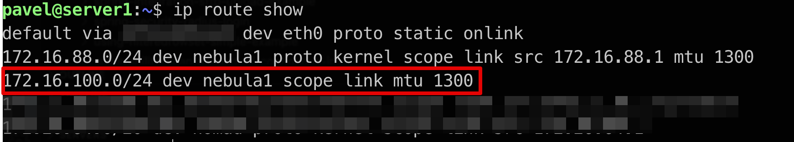


[Nebula](https://github.com/slackhq/nebula) is a scalable overlay networking tool with a focus on performance, simplicity, and security. It lets you seamlessly connect computers anywhere in the world.


This post is about extending the local network by another server running anywhere in the world, everything secured by the Nebula network.

Devices on the local network should be able to access devices on the Nebula network and some devices need to access devices on the local network as well.

## Network and devices specification
At first, let's define network addresses and existing devices:
Here, you can find the network address ranges:
| Network name | Network CIDR |
| ------ | ----------- |
| local network   | 172.16.100.0/24 |
| nebula network | 172.16.88.0/24 |

Here, you can find the device list with IP addresses in both networks:
| Device Name | Local Network IP | Nebula IP |
| ------ | ----------- |  ----------- |
| local server | 172.16.100.10 | 172.16.88.4 |
| cloud server | - | 172.16.88.1 |
| local PC | 172.16.100.159 | - |
| local service | 172.16.100.184 | - |

## Setup local server
Enable packet forwarding between interfaces:
```bash
echo 1 > /proc/sys/net/ipv4/ip_forward
```

### Setup iptables
Check a default FORWARD policy
```bash
sudo iptables -L -v -n | grep "Chain FORWARD"
```

If the previous command shows `policy ACCEPT`, you only need to add POSTROUTING rule:
```bash
# All traffic to local network will be hidden behind IP of the enp3s0 interface (similar to SNAT)
sudo iptables -t nat -A POSTROUTING -o nebula1 -j MASQUERADE
```


You can change the default `FORWARD` policy using this command (from `ACCEPT` to `DENY`):
```bash
sudo iptables --policy FORWARD DROP
```


If the default `FORWARD` policy is `DENY`, you need to enable forward traffic between nebula interface (`nebula1` on my machine) and interface with IP assigned from my local network range (`enp3s0` in my case)
```bash
sudo iptables -A FORWARD -i nebula1 -o enp3s0 -j ACCEPT
sudo iptables -A FORWARD -i enp3s0 -o nebula1 -m state --state ESTABLISHED,RELATED -j ACCEPT
# All traffic to local network will be hidden behind IP of the enp3s0 interface (similar to SNAT)
sudo iptables -t nat -A POSTROUTING -o enp3s0 -j MASQUERADE
```
The previous commands enable any traffic from the cloud server to any IP in a local network.
To enable specific traffic from cloud server only, run instead of the first command (`sudo iptables -A FORWARD -i nebula1 -o enp3s0 -j ACCEPT`)
```bash
# If you want to enable to call port 80 on IP 172.16.100.184 only
sudo iptables -A FORWARD -i nebula1 -p tcp -o enp3s0 -d 172.16.100.184 --dport 80 -j ACCEPT
```
If the default `FORWARD` policy is `DENY`, you need to enable ongoing forwarded traffic from the local network to the nebula network as well:
```bash
sudo iptables -A FORWARD -i enp3s0 -o nebula1 -j ACCEPT
sudo iptables -A FORWARD -i nebula1 -o enp3s0 -m state --state ESTABLISHED,RELATED -j ACCEPT
# Not needed, if run the following command, all traffic comes from any IP in the local network will be visible in nebula network as traffic from IP of the nebula1 interface
sudo iptables -t nat -A POSTROUTING -o nebula1 -j MASQUERADE
```

### Generate Nebula certificate
When generating Nebula certificate for local server, you need include `-subnets` argument with your local network CIDR, for example:
```bash
./nebula-cert sign -name "local-server" -ip "172.16.88.4/24" -groups "servers,home" -subnets "172.16.100.0/2
4"
```

## Setup local network
Devices on the local network need to know, who is the gateway to the Nebula network.

You can add a special route to each device:
```bash
sudo ip route add 172.16.88.0/24 via 172.16.100.10 [dev {DEVICE}]
```
or for example, in the case of Mikrotik device, add it globally for all devices on the local network:
```bash
/ip route
add comment="Destination nebula" distance=1 dst-address=172.16.88.0/24 gatewa
    172.16.100.10
```

## Setup cloud server
Cloud server must have a custom route to send traffic to `IP CIDR 172.16.100.0/24` via nebula host `172.16.88.4`, so add these lines to your Nebula config on the cloud server:
```yaml
tun:
  unsafe_routes:
    - route: 172.16.100.0/24
      via: 172.16.88.4
```
This configuration adds a route on nebula startup, check it (`ip route show`):


## Test it
### Test access from local PC to cloud server
```console
 pavel@MacBook-Pro  ~  ping 172.16.88.1
PING 172.16.88.1 (172.16.88.1): 56 data bytes
64 bytes from 172.16.88.1: icmp_seq=5 ttl=64 time=63.424 ms
64 bytes from 172.16.88.1: icmp_seq=6 ttl=64 time=63.076 ms
64 bytes from 172.16.88.1: icmp_seq=7 ttl=64 time=56.294 ms
64 bytes from 172.16.88.1: icmp_seq=8 ttl=64 time=72.705 ms
64 bytes from 172.16.88.1: icmp_seq=9 ttl=64 time=65.074 ms
```

### Test access from cloud server 
The cloud server needs to have access to the local service available on `172.16.100.184:80`:
```console
pavel@server1:~$ wget http://172.16.100.184/
--2021-12-12 21:18:24--  http://172.16.100.184/
Connecting to 172.16.100.184:80... connected.
HTTP request sent, awaiting response... 200 OK
```