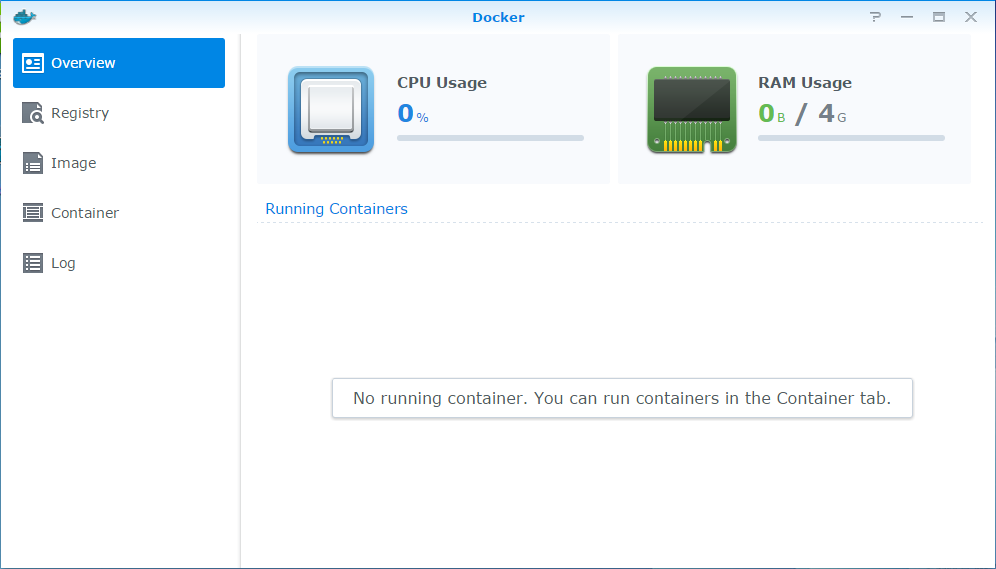
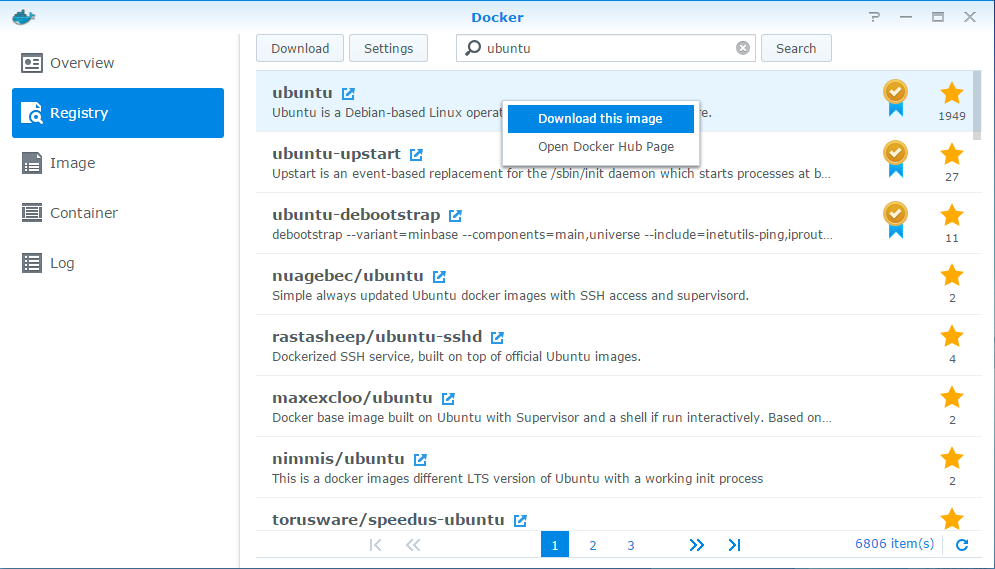
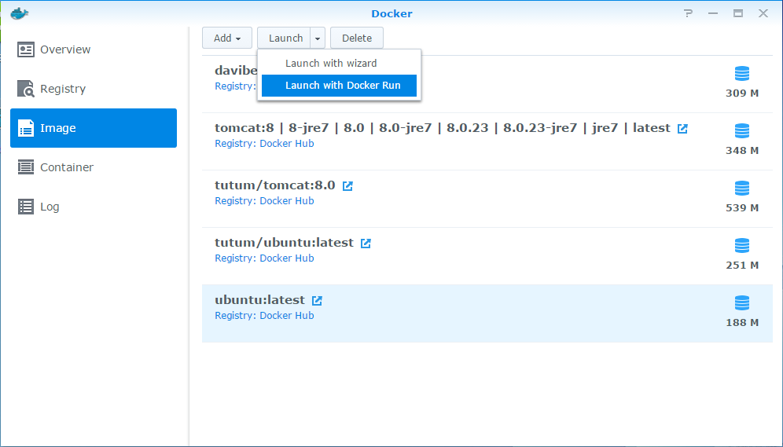
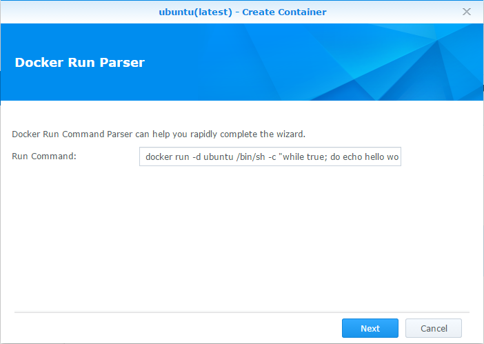
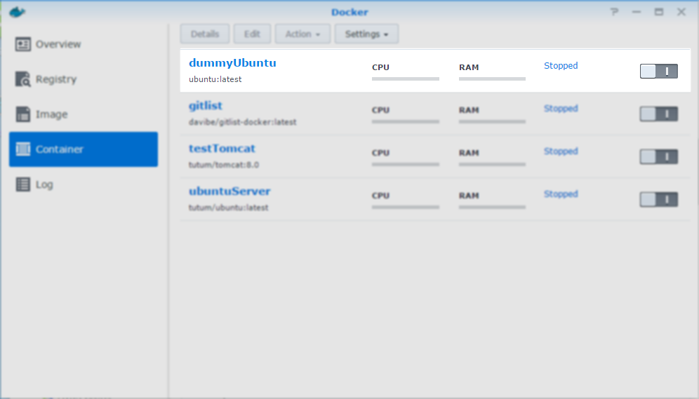
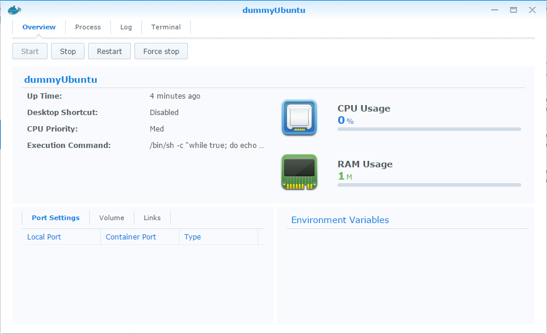
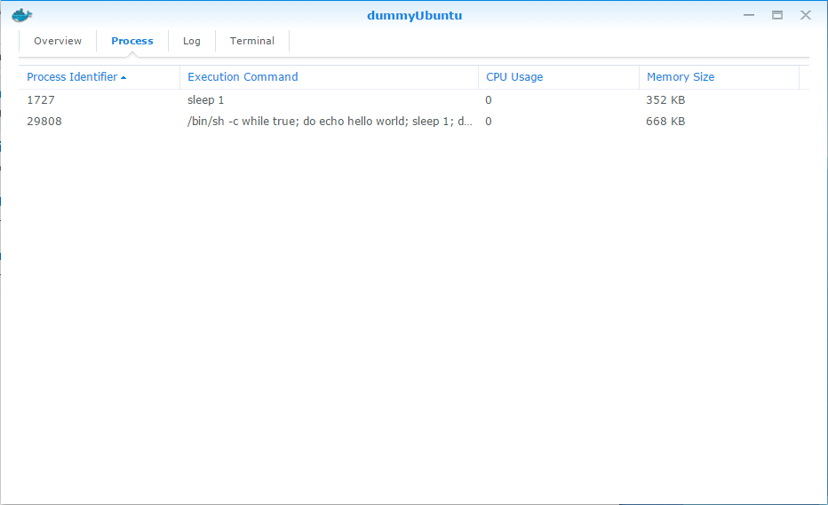
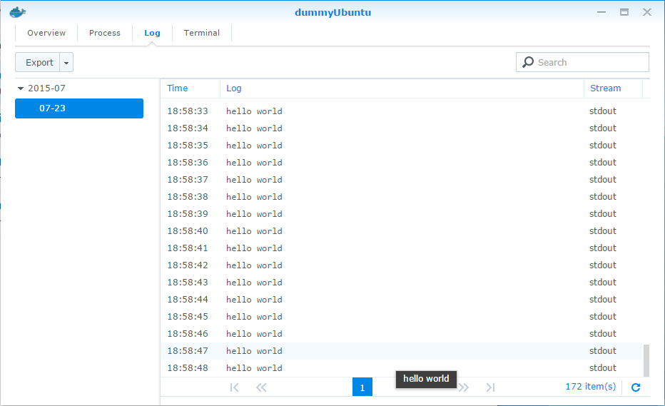
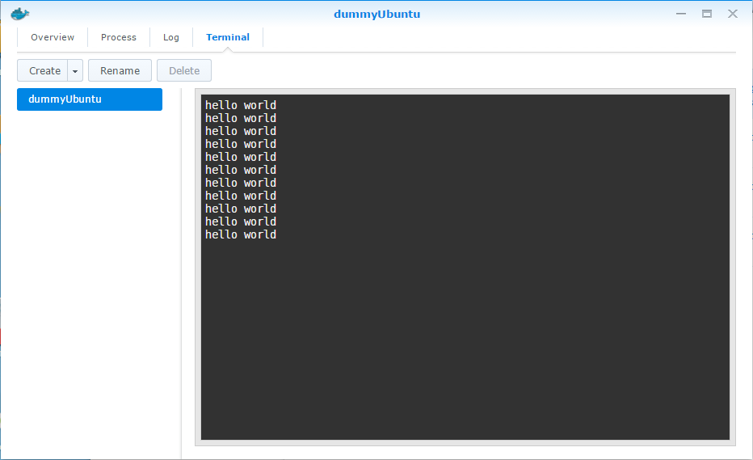

##  Installation

Simply find and install a Docker application from the Synology Package Center.

**Note**: If you do not find the application in your Package Center, your Synology is most probably not supported yet:

> Due to the hardware requirement, Docker will be only available on the following models: 18 series: DS3018xs, DS918+, DS718+, DS218+ 17 series: FS3017, FS2017, RS18017xs+, RS4017xs+, RS3617xs+, RS3617xs, RS3617RPxs, DS3617xs, DS1817+, DS1517+ 16 series: RS18016xs+, RS2416+, RS2416RP+, DS916+, DS716+II, DS716+, DS216+II, DS216+ 15-series:     RC18015xs+, DS3615xs, DS2415+, DS1815+, DS1515+, RS815RP+, RS815+, DS415+ 14-series:     RS3614xs+, RS3614xs, RS3614RPxs, RS2414RP+, RS2414+, RS814RP+, RS814+ 13-series:     DS2413+, RS3413xs+, RS10613xs+, DS1813+, DS1513+, DS713+ 12-series:     DS3612xs, RS3412xs, RS3412RPxs, RS2212RP+, RS2212+, DS1812+, DS1512+, RS812RP+, RS812+, DS412+, DS712+ 11-series:     DS3611xs, DS2411+, RS3411xs, RS3411RPxs, RS2211RP+, RS2211+, DS1511+, DS411+II, DS411+ 10-series:     DS1010+, RS810RP+, RS810+, DS710+([source, last updated 09-29-2017](https://www.synology.com/en-us/dsm/packages/Docker))

## How to use it?

When you start a Docker application, you will see an application menu on the left side:

- Overview
- Registry
- Image
- Container
- Log

### Overview

Here you will see your running containers, i.e. your running applications including allocated memory and CPU resources.



The real command in Docker:

```bash
docker ps
```

### Registry

On the registry page, you can search for new images (the same as on [the official site](https://registry.hub.docker.com/)). You can also add some new repositories (in addition to the official site) in Settings.

The real command in Docker:

```bash
docker search ubuntu
```



After you found your image (e.g. ubuntu in our case), you should download it to your Synology. All Images are read-only and you can use them multiple times for more containers.

The real command in Docker:

```bash
docker pull ubuntu
```

### Image

Here you will find images available on your Synology, ready to create new containers using a wizard or directly with a `docker run` command. You can usually find this command on the official page with an image.

The real command in Docker:

```bash
docker images
```



We use a [long running process](http://blog.pavelsklenar.com/10-useful-docker-commands-tip-tricks/) for creating a new container from a `docker run` command:

```bash
docker run -d ubuntu /bin/sh "while true; do echo hello world; sleep 1; done"
```



The Synology wizard checks your command for compatibility, not all `docker run` parameters are available for use.

- Docker run supports the below parameters:
    - `"d", "detach"`
    - `"e", "env"`
    - `"link"`
    - `"m", "memory"`
    - `"name"`
    - `"P", "publish-all"`
    - `"p", "publish"`
    - `"privileged"`
    - `"v", "volume"`
- Docker run does not support the below parameters:
    - `"a", "attach"`
    - `"add-host"`
    - `"c", "cpu-shares"`
    - `"cap-add"`
    - `"cap-drop"`
    - `"cidfile"`
    - `"cpuset"`
    - `"device"`
    - `"dns"`
    - `"dns-search"`
    - `"entrypoint"`
    - `"env-file"`
    - `"expose"`
    - `"h", "hostname"`
    - `"i", "interactive"`
    - `"lxc-conf"`
    - `"net"`
    - `"restart"`
    - `"rm"`
    - `"security-opt"`
    - `"sig-proxy"`
    - `"t", "tty"`
    - `"u", "user"`
    - `"w", "workdir"`

Basically, your containers need to run as a [daemon](https://docs.docker.com/articles/basics/) on your Synology (an opposite to run an interactive shell). It makes sense, you cannot run an interactive shell in your Synology Docker application in a web browser.

Back to our new ubuntu container (actually got name dummyUbuntu). The wizard offers to set more options, but we want to create a dummy container, so click Next, Next, Next.

### Container

The dummyUbuntu container appears now on the Container page.



The real command in Docker (prints all containers including stopped):

```bash
docker ps -a
```

The last step is waiting for us: Run it.

When you double click on any container, a window with some more details about a running container appears.



You see some information about our dummyUbuntu container and capability to Start, Stop, Restart it.

The real command in Docker:

```bash
docker start/stop/restart dummyUbuntu
```

You can see other information about a running container using the top menu.



The real command in Docker:
```bash
docker top dummyUbuntu
```

On the Log tab, you can see logs from your container (not automatically refreshed, maybe in the future with the parameter `-f` as available in the standard Docker client).



The real command in Docker:

```bash
docker logs dummyUbuntu
```

The last tab Terminal shows output of a command used to run your container (in our case the dummy long running process: `"while true; do echo hello world; sleep 1; done"` )



The real command in Docker:

```bash
docker attach dummyUbuntu
```

**Note:** The `docker attach` command never starts a new instance of a shell, instead of that you will see an ongoing output of the first start command. For more alternatives, see the point 8 on page [10 Useful Docker Commands – Tips and Tricks](http://blog.pavelsklenar.com/10-useful-docker-commands-tip-tricks/).
