This post is about installing an Ubuntu desktop on your Synology NAS. You are able to install any other Linux [distribution](https://distrowatch.com/) using this recipe, it does not matter whether desktop or server type of any distro.

To install any virtual machine to your Synology, you need to install [Virtual Machine Manager](https://www.synology.com/en-global/dsm/packages/Virtualization) to your NAS. Your model must be supported:

> 19 series: RS1219+ 18 series: FS1018, RS3618xs, RS818RP+, RS818+, RS2818RP+, RS2418RP+, RS2418+, DS3018xs, DS918+, DS718+, DS218+, DS1618+ 17 series: FS3017, FS2017, RS3617xs, RS3617RPxs, RS4017xs+, RS3617xs+, RS18017xs+, DS3617xs, DS1817+, DS1517+ 16 series: RS2416RP+, RS2416+, RS18016xs+, DS916+ 15 series: RS815RP+, RS815+, RC18015xs+, DS3615xs, DS2415+, DS1815+, DS1515+ 14 series: RS3614xs, RS3614RPxs, RS3614xs+ 13 series: RS3413xs+, RS10613xs+ 12 series: RS3412xs, RS3412RPxs, DS3612xs 11 series: RS3411xs, RS3411RPxs, DS3611xs ([source](https://www.synology.com/en-global/dsm/packages/Virtualization), last updated 2018-08-13)

We can summarize a recipe into the following steps:

- Downloading an installation image
- Creating a virtual machine
- Installation of a system
- Post-installation recommendations

## Downloading an installation image

You can install your favourite image (ISO) of your distro. I have used an [Ubuntu Desktop](https://www.ubuntu.com/download/desktop) because it is very popular with most people (actually I do not know why :)).

Download ubuntu-xxx-desktop-amd64.iso and save it to your NAS.

## Creating Virtual Machine

Creating your own Virtual Machine is the most important step, but Synology has its own wizard which is very helpful and I think is very easy to understand. So run Virtual Machine Manager, select Virtual Machine on the left menu a click to create.

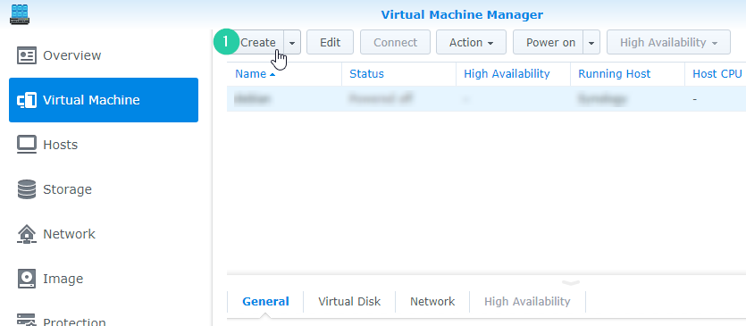

### Choose Operating System

In the first step of the wizard, select the Linux choice. Option Other may be helpful for some exotic or old distros.

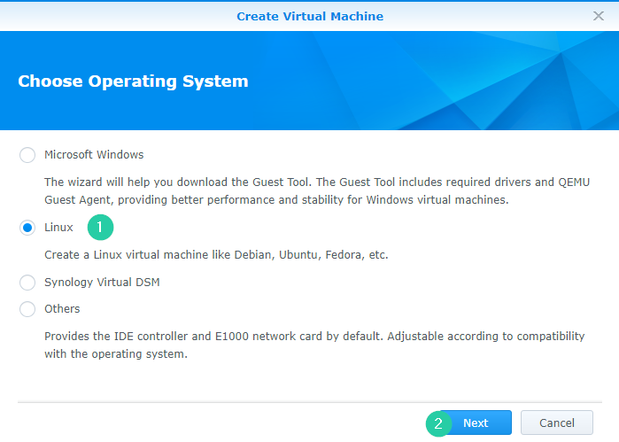

### Select Storage

The step 2 is related to storage, where your machine will physically be installed. If it is your first install, you will be prompted to create a new one. Your data on NAS will not be affected, all ubuntu files will be separated.

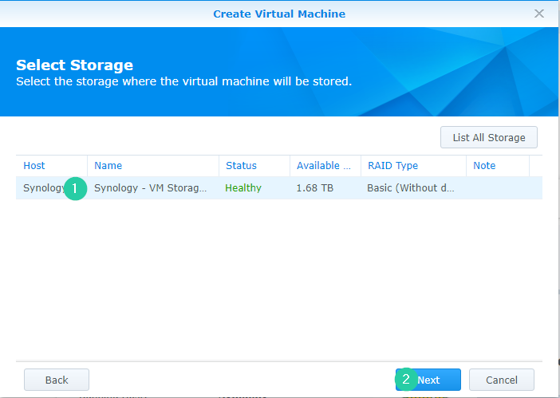

### General Configuration

The step 3 is related to general configuration. As you maybe noticed, you are creating a new virtual machine, so you need to assign CPU (2), RAM (3), video card (3) etc. A number of assigned RAM is related to your available memory, but you need to know, that the DSM system needs memory for its run as well so you cannot count with 4 virtual machines (4 x 1GB), when your NAS has 4 GB in total.

Actually, exactly one virtual machine consumes memory assigned by you plus 256 MB + 80 MB  (resources for the hypervising: Each VM requires 256 MB; each vCPU requires 80 MB), so 1GB assigned to your Virtual Machine needs 1360 MB in total.

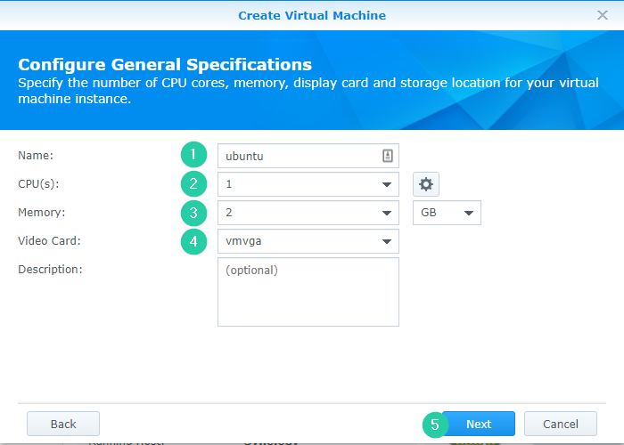

### Storage

The 4th step is related to storage. Now you need to set up your previously downloaded ISO image for bootup (1) and setup capacity of the virtual disk (2). As you noticed, I set 10 GB what is quite sufficient for showing Ubuntu (after installing it takes about 5 GB)
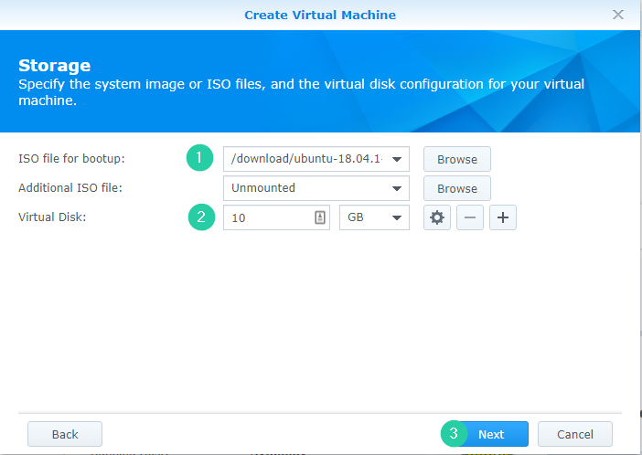

### Network Configuration

The step number 5 is related to network configuration. If you do not have any special requirements, you can leave it as it, or you can disable network inside your Ubuntu, so no internet access.

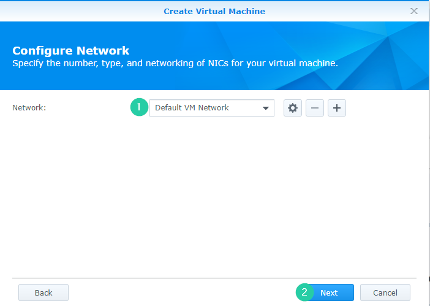

### Other Settings

The last but one step is not so important, all default choices are sufficient. Maybe you can set autostart to yes.

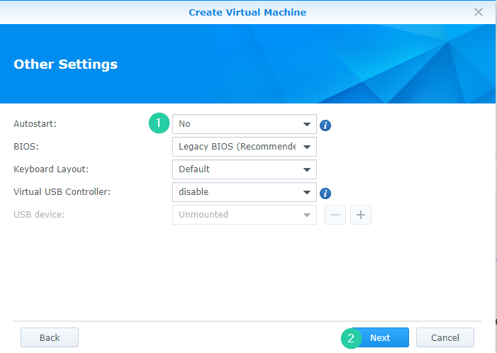

### Assign Permissions

The last step is about assigning permissions to power on/off or restart a virtual machine, I checked admin only.

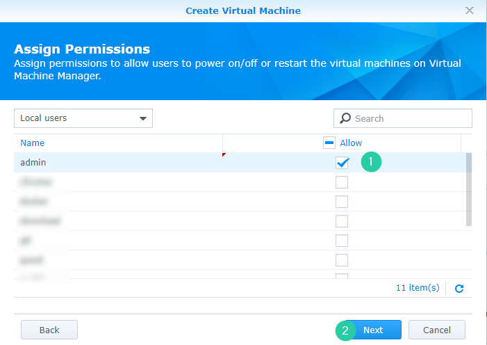

### Summary

After submitting the summary page, your virtual machine will be running (please, check Power on the virtual machine after creation).

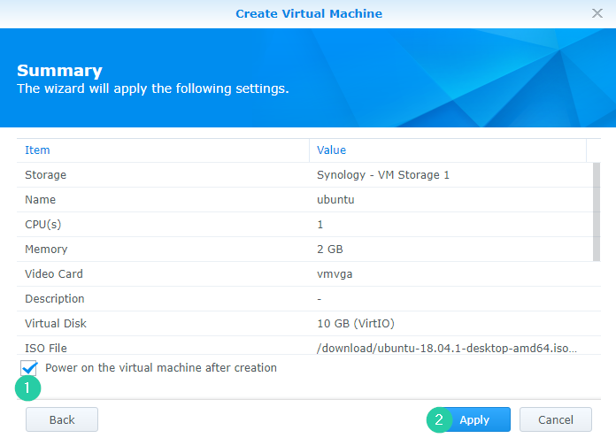

On the Virtual Machine page, select your previously created machine and click to Connect (1).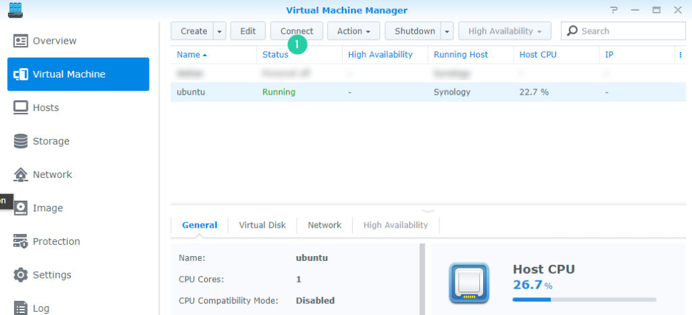A new tab with vnc session to your machine will be created. Please follow steps depending on your needs and an installing system.

## Installation of a system

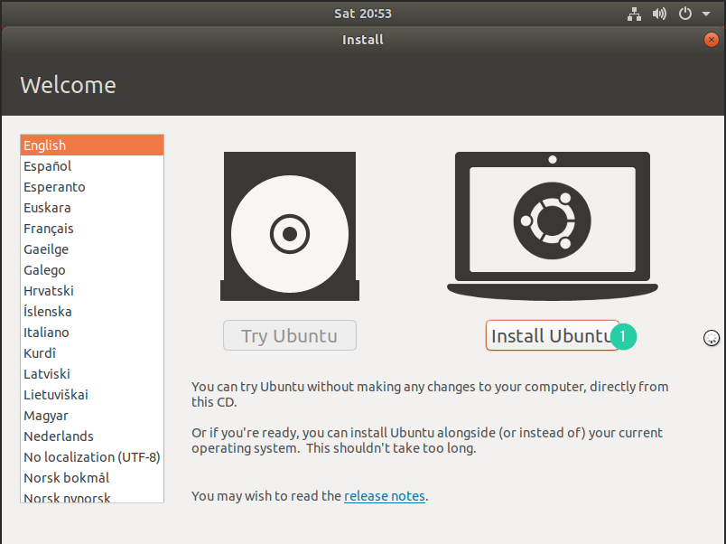

Your installation process has been completed.
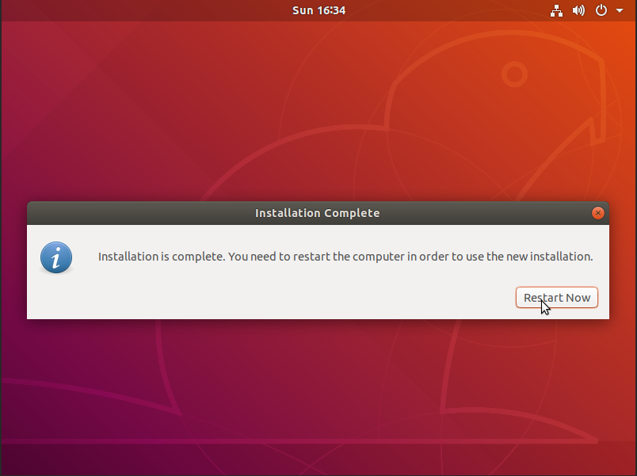

## Post-installation recommendations

When the installation process is done, it is strongly recommended to install a guest agent. It is used to exchange information between the host and guest, and to execute a command in the guest, allowing properly shut down or restart your machine from the Virtual Machine Manager application.

The command is here:

`sudo apt-get install qemu-guest-agent`

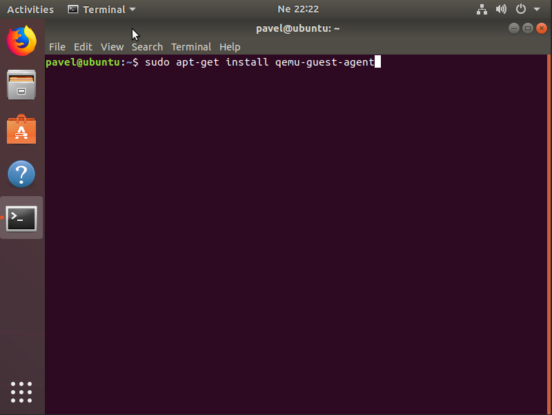

And it is all, enjoy your new virtual machine.
