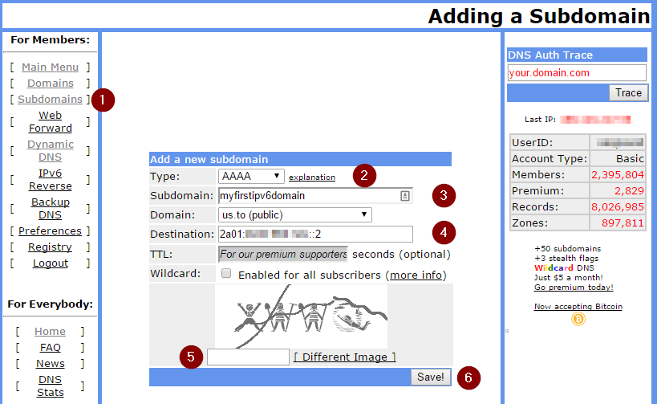

This post shows how to make any device (running on Windows, MAC OS X, Linux-based systems) visible public (outside of your private or home network), without any public IPv4 address. I mean the state when you are stuck behind a NAT gateway or proxy and also your Internet Service Provider (ISP) did not supply any public IPv4 or IPv6 address to you. The solution is an **IPv6 tunneling**.

Moreover, you will receive a public IP address anywhere you connect your device to any network with this tutorial, no future configuration required, isn't it attractive for you?

## List of Content:

- [Why IPv6?](#why_ipv6)
- [Getting an IPv6 address](#getting_ipv6_address)
- [Choosing a tunneling provider](#choosing_tunneling_provider)
- [Tunnel setup](#tunnel_setup)
- [Register your own domain](#register_your_own_domain)
- [Access restrictions](#access_restrictions)
- [Conclusion](#conclusions)

## Why IPv6?

IPv4 addresses become very valuable article because its global pooling capacity were already exhausted on 1 February 2011 ([source](https://www.icann.org/en/system/files/press-materials/release-03feb11-en.pdf)).

I cannot say it globally, but nowadays you may encounter problems to receive your own public IPv4 address from your Internet provider in some locations due to insufficient capacity.

> Available Pool of Unallocated IPv4 Internet Addresses Now Completely Emptied. The Future Rests with IPv6.([source](https://www.icann.org/en/system/files/press-materials/release-03feb11-en.pdf)).

## Getting an IPv6 Address

So if you want to get an IPv6 address, you have few ways to do it. The first one (and the best one) is if your Internet Service Provider (ISP) supplies them to you. All you have to do is enabling IPv6 on your computer (maybe it has been already enabled) and you're done.

Most of us are not so lucky, fortunately, there exist some tunneling protocols which allows you to get and use an IPv6 address over your IPv4 connection to the internet.

I do not want to use any of automatic tunneling protocols (i.e. 6to4, Teredo, ISATAP). They are not suitable for our "server" purpose. Most tunnels use IPv4 protocol 41 to transport IPv6 over IPv4 and not all firewalls and NATs can properly pass protocol 41 without any special configuration.

> **Note:** ICMP is protocol 1, IGMP is protocol 2, TCP is protocol 6, UDP is protocol 17. ([source](https://wiki.ubuntu.com/IPv6))

I prefer and would like to show tunneling using [tunnel brokers.](https://en.wikipedia.org/wiki/List_of_IPv6_tunnel_brokers) These tunnels are more deterministic and easier to debug than automatic tunneling, exactly what we need to make our device public and stable all the time.

You need a special broker (a company or organization providing free IPv6 in IPv4 tunneling), on the other hand, they generally support one of [TSP](https://en.wikipedia.org/wiki/Tunnel_Setup_Protocol) and [AYIYA](https://en.wikipedia.org/wiki/AYIYA) protocols. These protocols send their tunneled packets over UDP, so they are passing most of NATs.

## Choosing a tunneling provider

The main public providers ([list of all](https://en.wikipedia.org/wiki/List_of_IPv6_tunnel_brokers)):

- [Hurricane Electric](http://tunnelbroker.net/) (6in4),
    
- [Freenet6](http://gogonet.gogo6.com/page/freenet6-ipv6-services) (TSP),
- [SixXS](http://www.sixxs.net/) (6in4, L2TP or AYIYA).
    

<table><tbody><tr><td style="text-align: center;"><strong>Provider</strong></td><td style="text-align: center;"><strong>Supported protocols</strong></td><td style="text-align: center;"><strong>Pros</strong></td><td style="text-align: center;"><strong>Cons</strong></td></tr><tr><td style="text-align: left;"><a class="http" href="http://tunnelbroker.net/">Hurricane Electric</a>&nbsp;(without any personal experience)</td><td style="text-align: left;"><ul><li>6in4</li></ul></td><td style="text-align: left;"><ul><li>Due to the used protocol, minimum packet overhead (IPv4 packet header is immediately followed by the IPv6 packet)</li></ul></td><td style="text-align: left;"><ul><li>Only 6in4 - possible problem with passing NATs (based on the protocol 41).</li></ul></td></tr><tr><td style="text-align: left;"><a class="http" href="http://gogonet.gogo6.com/page/freenet6-ipv6-services">Freenet6</a></td><td style="text-align: left;"><ul><li>TSP</li></ul></td><td style="text-align: left;"><ul><li>User-friendly setting with a desktop client.</li><li>Very fast setup of a tunnel - from registration and installation to usage (compared with SixXS)</li><li>Supports anonymous connections.</li></ul></td><td style="text-align: left;"><ul><li>Not so many gogo6 servers - i.e.&nbsp;tunnel servers&nbsp; nearest to your locality (<a href="http://www.gogo6.com/freenet6/service-status">service status</a>).</li><li>Not for commercial use.</li></ul></td></tr><tr><td style="text-align: left;"><a class="http" href="http://www.sixxs.net/">SixXS</a></td><td style="text-align: left;"><ul><li>6in4</li><li>L2TP</li><li>AYIYA</li></ul></td><td style="text-align: left;"><ul><li>Supports various protocols.</li><li>No traffic limits.</li><li>Allowed to use SixXS commercially (without any guarantee).</li><li>Client tool (AICCU) supports many platforms&nbsp;(Windows, Linux, FreeBSD, MAC OS X etc.)</li><li>Ability to choose your nearest <a href="https://www.sixxs.net/pops">POP</a><sup>1</sup> (many servers all around the world).</li><li>Great FAQ and support on the product website.</li></ul>&nbsp;</td><td style="text-align: left;"><ul><li>&nbsp;Signup phase&nbsp;is&nbsp;verified by a real human (when you fill in e.g.&nbsp;a too concise reason&nbsp;why you want to use their service, you will be rejected and you need to repeat the whole process).</li><li>Only one possible registration to one person.</li><li>Signup phase followed by &nbsp;a tunnel requesting&nbsp;phase (needs to be manually approved as well).</li><li>Your latency to your&nbsp;<a href="https://www.sixxs.net/pops/">POP<sup>1</sup></a> must be lower than 100 ms, otherwise a tunnel will not be established.</li></ul></td></tr></tbody></table>

1Point of Presence - i.e. tunnel server  nearest to your locality

I have some little experience with Freenet6 (which was actually fine), but I have chosen SixXS for really great support on their website and one of a POP in my country (I have very low latency around 2 ms).

## IPv6 Tunnel setup

### Sign up for SixXS

Fill in the form on the [website](https://www.sixxs.net/signup/). Be careful insufficient information provided by you may cause rejection of your request. I was rejected as well for my concise reason why I want to use tunneling. Your data will be verified by a real human so may expect your result within few days. Repeated requests take more time.

### Request tunnel

Once when you receive your new credentials, sign in and create a new tunnel request (in the left side menu) on the [User home](https://www.sixxs.net/home/) page.

Choose "Dynamic NAT-traversing IPv4 Endpoint using [AYIYA](https://www.sixxs.net/tools/ayiya/)" to apply for this type of tunnel (again, AYIYA has no problem to pass any NATs).

### Tunnel configuration

Download [AICCU](https://www.sixxs.net/tools/aiccu/) for your platform and [install a driver when needed.](https://www.sixxs.net/faq/aiccu/?faq=tundriver)

I want to set up my Raspberry PI to use an IPv6, so I will install AICCU to Raspbian OS (similar to Debian, Ubuntu etc.) If you are using Windows, follow these [instructions](https://www.sixxs.net/faq/account/?faq=10steps).

The installation process is very simple:

```bash
apt-get install aiccu
```
You will be prompt for your SixXS credentials during an installation. Once installed run

```bash
aiccu start
```
or

```bash
bash/etc/init.d/aiccu start
```
Now you can test your IPv6 connectivity to any IPv6-only website, e.g. ipv6.google.com:

```bash
pi@raspberrypi / $ ping6 ipv6.google.com
PING ipv6.google.com(bud02s21-in-x0e.1e100.net) 56 data bytes
64 bytes from bud02s21-in-x0e.1e100.net: icmp_seq=1 ttl=58 time=12.4 ms
64 bytes from bud02s21-in-x0e.1e100.net: icmp_seq=2 ttl=58 time=12.3 ms
64 bytes from bud02s21-in-x0e.1e100.net: icmp_seq=3 ttl=58 time=12.4 ms
64 bytes from bud02s21-in-x0e.1e100.net: icmp_seq=4 ttl=58 time=12.2 ms
```

When you stop your tunnel:

```bash
aiccu stop
```
you may expect a negative result:

```bash
pi@raspberrypi / $ ping6 ipv6.google.com 
connect: Network is unreachable 
```

You may test your running tunnel on `http://ipv6-test.com` as well:


Finally, you can test connectivity to your device from any IPv6 capable device:

```bash
home@mypc / $ ping6 2a01:****:****:****::2
PING 2a01:****:****:****::2(2a01:****:****:****::2) 56 data bytes
64 bytes from 2a01:****:****:****::2: icmp_seq=1 ttl=64 time=5.1 ms
64 bytes from 2a01:****:****:****::2: icmp_seq=2 ttl=64 time=5.3 ms
64 bytes from 2a01:****:****:****::2: icmp_seq=3 ttl=64 time=5.1 ms
64 bytes from 2a01:****:****:****::2: icmp_seq=4 ttl=64 time=5.5 ms
```

How it works:


## Register your own domain

As you noticed, your new IPv6 address is not so easy to remember as any IPv4 address.

Fortunately, you can use any of domain registry provider as you are familiar with a registration of IPv4 addresses. They exist some free providers which offer registrations of third-level domains.

I used to register my domains by [noip.com](http://www.noip.com/), but they support only IPv4 domains for free (i.e. IPv6 needs AAAA records in DNS). No problem, we can try [freedns.afraid.org](http://freedns.afraid.org):



After your registration, select Subdomains (1), then select AAAA type (2) (i.e. you want to insert IPv6 address). Choose your own new third-level domain (3) and insert your IPv6 address to Destination (4). When you submit a form you need to wait a few minutes to update DNS servers. After that, your device will be accessible through the myfirstipv6domain.us.to.

## Access restrictions

As you may be noticed, an IPv6 world is completely different from IPv4 and you cannot access IPv4-only sites from an IPv6-only device and vice versa. So you encounter a problem when you would like to visit your public IPv6-only device from any IPv4-only device. How to get over this limit?

Get another IPv6 tunnel - fine enough, but your device will be still far away from public.

The second option is more "public". Use an IPv4 gate to translate an IPv4 request to IPv6 request. SixXS offers a free [IPv4 and IPv6 gateways](https://www.sixxs.net/tools/gateway/).

### How to use IPv4 gateway?

Check my example. You would like to visit an IPv6-only website (e.g. you have started an Apache server on your new IPv6-only device) from an IPv4-only device.

We will use a domain name from the previous step, i.e. myfirstipv6domain.us.to to access our new Apache server.

If so, simply append  a suffix "**.ipv4.sixxs.org**" after your domain, i.e. myfirstipv6domain.us.to.ipv4.sixxs.org:


## Conclusion

As you can see, it is quite easy to make any of your device public anywhere you want. Naturally, the described solution is appropriate for a home server only, where you want to share some information to public or access your home server from outside.

I am using this solution on my Raspberry PI with Raspbian OS to share a simple web site from my weather station. I got rid of all dependencies on my NAT setting and port forwarding.

The tunnel has no blackouts and its latency is very low:

")
