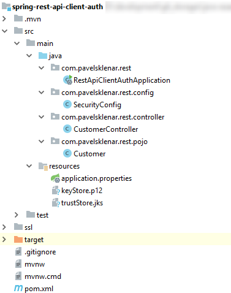
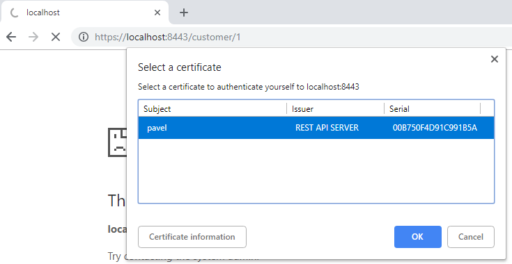
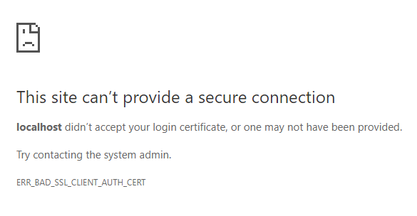

This post is about an example of securing **REST API** with a client certificate (a.k.a. **X.509** certificate authentication).

In other words, a client verifies a server according to its certificate and the server identifies that client according to a client certificate (so-called **the mutual authentication**).

In connection with **Spring Security**, we will be able to perform some additional authentication and authorization.

Technologies used:

1. Spring Boot 2.0.5.RELEASE
2. Spring Web + Security 5.0.8.RELEASE
3. Embedded Tomcat 8.5.34

Quick post overview:

- Create a simple REST API service (without any security)
- Create certificates for server and client
- Configure the server to serve HTTPS content
- Configure the server to require a client certificate
- Spring Security for further client's authentication and authorization
- Test secured REST API

## Final Project Structure


## Creating a new base Spring Boot project

We will start with a new project generated by [Spring Initializr](https://start.spring.io/). We need just only two Spring dependencies, i.e. Spring Web + Spring Security.

All required dependencies are shown here:
```xml
<dependency>
    <groupId>org.springframework.boot</groupId>
    <artifactId>spring-boot-starter-security</artifactId>
</dependency>
<dependency>
    <groupId>org.springframework.boot</groupId>
    <artifactId>spring-boot-starter-web</artifactId>
</dependency>
```
## Create a simple REST API service

Let's create a simple REST controller serving a detail about a customer using HTTP GET method:

```java
@RestController
@RequestMapping("/customer")
public class CustomerController {
 
    @GetMapping("/{id}")
    public Customer GetCustomer(@PathVariable Long id) {
        return new Customer(id, "Customer" + id);
    }
}
```

Displaying URL http://localhost:8080/customer/1 returns this JSON object:
```json
{
    "id":1,
    "name":"Customer1"
}
```
## Create certificates for server and client

I want to stay in focus on securing REST API so I will show you how to generate all required files in a very concise way. For more details about commands, visit my other blog post about [creating a PKCS #12 key store.](https://blog.pavelsklenar.com/how-to-create-pkcs-12-for-your-application/)
```bash
#Create folders to generate all files (separated for client and server)
mkdir ssl && cd ssl && mkdir client && mkdir server
 
## Server
# Generate server private key and self-signed certificate in one step
openssl req -x509 -newkey rsa:4096 -keyout server/serverPrivateKey.pem -out server/server.crt -days 3650 -nodes
# Create PKCS12 keystore containing private key and related self-sign certificate
openssl pkcs12 -export -out server/keyStore.p12 -inkey server/serverPrivateKey.pem -in server/server.crt
# Generate server trust store from server certificate
keytool -import -trustcacerts -alias root -file server/myCertificate.crt -keystore server/trustStore.jks
 
## Client
# Generate client's private key and a certificate signing request (CSR)
openssl req -new -newkey rsa:4096 -out client/request.csr -keyout client/myPrivateKey.pem -nodes
 
## Server
# Sign client's CSR with server private key and a related certificate
openssl x509 -req -days 360 -in request.csr -CA server/server.crt -CAkey server/serverPrivateKey.pem -CAcreateserial -out client/pavel.crt -sha256
 
## Client
# Verify client's certificate
openssl x509 -text -noout -in client/pavel.crt
# Create PKCS12 keystore containing client's private key and related self-sign certificate
openssl pkcs12 -export -out client/client_pavel.p12 -inkey client/myPrivateKey.pem -in client/pavel.crt -certfile server/myCertificate.crt
```

You can find the SSL folder with all generated files on [the project's GitHub page](https://github.com/pajikos/java-examples/tree/master/spring-rest-api-client-auth).

We will use files in the server folder to configure our server.

The final client's file `client/client_pavel.p12` can be either imported into your browser or used in another client application.

On Windows just simply open this file and import it into your system to test REST API with any browser.

## Configure the server to serve HTTPS content

Basically, there are two options on how to do it.

You can use any standalone server (e.g. [Tomcat](https://tomcat.apache.org/tomcat-9.0-doc/ssl-howto.html), [WildFly](http://www.mastertheboss.com/jboss-server/jboss-security/complete-tutorial-for-configuring-ssl-https-on-wildfly) etc.) so the configuration would be specific to your choice. I prefer this choice for production environments.

Instead of configuring an application server, I will show you the second simpler way of using embedded Tomcat server inside Spring Boot.

The configuration is quite easy, we will change the port to 8443 and configure the server key store generated in the previous steps:
```java
# Define a custom port (instead of the default 8080)
server.port=8443
# The format used for the keystore
server.ssl.key-store-type=PKCS12
# The path to the keystore containing the certificate
server.ssl.key-store=classpath:keyStore.p12
# The password used to generate the certificate
server.ssl.key-store-password=changeit
```
## Configure the server to require a client certificate

The configuration of any server to require a client certificate (i.e. [the mutual authentication](https://searchsecurity.techtarget.com/definition/mutual-authentication)) is very similar to the server side configuration except using words like a trust store instead of a key store. So the embedded Tomcat configuration seems like this:

```java
# Trust store that holds SSL certificates.
server.ssl.trust-store=classpath:trustStore.jks
# Password used to access the trust store.
server.ssl.trust-store-password=changeit
# Type of the trust store.
server.ssl.trust-store-type=JKS
# Whether client authentication is wanted ("want") or needed ("need").
server.ssl.client-auth=need
```
The embedded server ensures now (without any other configuration) that the clients with a valid certificate only are able to call our REST API.

Other clients will be declined by the server due to unable to make correct SSL/TLS handshake (required by the mutual authentication).

**Please note, that all configuration items starting server.\* are related to an embedded Tomcat only. You do not need it when using any standalone application server.**

## Spring Security for further client authentication and authorization

It would be fine to get an incoming client into our application as a logged user.

It will give us the possibility to perform some other authentications and authorizations using Spring Security (e.g. securing method call to the specific role only).

Until now no Spring Security was needed, but all clients with any valid certificate may perform any call in our application without knowing who is the caller.

So we must configure Spring Security to create a logged user using a username from a client certificate (usually from the [CN](https://www.ssl.com/faqs/common-name/) field, see the method call `subjectPrincipalRegex`):

```java
@Configuration
@EnableWebSecurity
@EnableGlobalMethodSecurity(securedEnabled = true)
public class SecurityConfig extends WebSecurityConfigurerAdapter {
 
    @Override
    protected void configure(HttpSecurity http) throws Exception {
        http.authorizeRequests()
                .anyRequest().authenticated().and()
                .x509()
                    .subjectPrincipalRegex("CN=(.*?)(?:,|$)")
                    .userDetailsService(userDetailsService());
    }
 
    @Bean
    public UserDetailsService userDetailsService() {
        return (UserDetailsService) username -&amp;amp;amp;amp;gt; {
            if (username.equals("pavel")) {
                return new User(username, "",
                        AuthorityUtils
                                .commaSeparatedStringToAuthorityList("ROLE_USER"));
            } else {
                throw new UsernameNotFoundException(String.format("User %s not found", username));
            }
        };
    }
}
```
Using the bean `UserDetailsService` is a kind of fake, but it shows an example of an additional authentication to accept only username "pavel".

In other words, it accepts a client with a certificate containing value "pavel" in certificate's field CN only (as mentioned before, configured with `subjectPrincipalRegex`).

As you maybe noticed, only user "pavel" is the member of the role "user", so now we are able to restrict method calls to the specific role only:

```java
@GetMapping("/{id}")
@Secured("ROLE_USER")
public Customer GetCustomer(@PathVariable Long id) {
    return new Customer(id, "Customer" + id);
}
```

## Test secured REST API

When you successfully imported `client/client_pavel.p12` into your system and the application runs, you can visit URL  `https://localhost:8443/customer/1.`

The first access of this page displays a window to select the correct certificate to authenticate with the server:



When you submit a wrong certificate, you will see the "access denied" page (otherwise JSON object returned):



It is all, you can find all source codes on [my GitHub profile](https://github.com/pajikos/java-examples/tree/master/spring-rest-api-client-auth).

Some useful links about this topic:

- [Spring Boot Official: Configure SSL](https://docs.spring.io/spring-boot/docs/current/reference/htmlsingle/#howto-configure-ssl)

