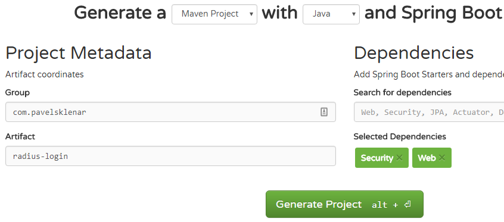

In this example, we will secure a home page (/home) with Spring Security using [Radius](https://www.cisco.com/c/en/us/support/docs/security-vpn/remote-authentication-dial-user-service-radius/12433-32.html) authentication.

Technologies used:

1. Spring Boot 2.0.4.RELEASE
2. TinyRadius 1.0.1
3. Embedded Tomcat 8.5.23

Quick Overview:

1. Create a new base Spring Boot project with required dependencies
2. Create a simple login using Spring Security
3. Create your own RadiusAuthenticationProvider
4. Simple test with a real Radius Server

## 1\. Project Structure


## 2\. Create a new base Spring Boot project

We will start with a new project generated by [Spring Initializr](https://start.spring.io/). Just only two Spring dependencies are required: Security and Web.



The generated project is ready to run with embedded Tomcat, but we need to add other required dependencies The first dependency is a `[tinyradius](http://tinyradius.sourceforge.net/)` as a client library to be able to call Radius server. The other two dependencies (`jstl` and `tomcat-embed-jasper`) are related to JSP pages, which will be used inside a login and a home page.

All required dependencies are shown here:
```xml
<dependency>
            <groupId>org.springframework.boot</groupId>
            <artifactId>spring-boot-starter-security</artifactId>
        </dependency>
        <dependency>
            <groupId>org.springframework.boot</groupId>
            <artifactId>spring-boot-starter-web</artifactId>
        </dependency>
        <dependency>
            <groupId>javax.servlet</groupId>
            <artifactId>jstl</artifactId>
        </dependency>
        <dependency>
            <groupId>org.apache.tomcat.embed</groupId>
            <artifactId>tomcat-embed-jasper</artifactId>
            <scope>provided</scope>
        </dependency>
        <dependency>
            <groupId>com.hynnet</groupId>
            <artifactId>tinyradius</artifactId>
            <version>1.0.1</version>
</dependency>
```
[Spring Initialzr](https://start.spring.io/) did usually not generate any dummy pages, so we need to add our pages, login.jsp and home.jsp.

We do not need an extra `Controller` class, so we register our pages into `ViewControllerRegistry` directly.

`ViewController` is required to be able to map view to its JSP page.
```java
@Configuration
public class MvcConfig extends WebMvcConfigurerAdapter {
     
    @Override
    public void addViewControllers(ViewControllerRegistry registry) {
        registry.addViewController("/").setViewName("home");
        registry.addViewController("/home").setViewName("home");
        registry.addViewController("/login").setViewName("login");
    }
 
    @Bean
    public InternalResourceViewResolver viewResolver() {
        InternalResourceViewResolver resolver = new InternalResourceViewResolver();
        resolver.setPrefix("/WEB-INF/pages/");
        resolver.setSuffix(".jsp");
        return resolver;
    }
}
```
## 3\. Create a simple login using Spring Security

It exits many examples how to configure Spring Security, so check google if you need to customize it. We do not need any special configuration, just to secure a home page. We will display a login page for non-authenticated users, it's all, no more requirements, no roles.
```java
@Configuration
@EnableWebSecurity
public class WebSecurityConfig extends WebSecurityConfigurerAdapter {
    @Override
    protected void configure(HttpSecurity http) throws Exception {
        http
            .authorizeRequests()
                .anyRequest().authenticated()
                .and()
            .formLogin()
                .loginPage("/login")
                .permitAll()
                .and()
            .logout()
                .permitAll();
    }
}
```
## 4\. Create your own RadiusAuthenticationProvider

You need to implement your own [`AuthenticationProvider`](http://www.baeldung.com/spring-security-authentication-provider), so the method `authenticate` is required:
```java
@Override
    public Authentication authenticate(Authentication authentication) throws AuthenticationException {
        String username = authentication.getName();
        RadiusPacket response = null;
        int attemptCount = 0;
        while (response == null && attemptCount++ < clients.size()) {
            response = authenticateInternally(clients.get(attemptCount - 1), username,
                    authentication.getCredentials().toString());
        }
        if (response == null) {
            logger.warn("User {}, calling radius does not return any value.", username);
            return null;
        }
        if (response.getPacketType() == RadiusPacket.ACCESS_ACCEPT) {
            logger.info("User {} successfully authenticated using radius", username);
            return new UsernamePasswordAuthenticationToken(username, "", new ArrayList<>());
        } else {
            logger.warn("User {}, returned response {}", username, response);
            return null;
        }
}
```
There is nothing special in this method except working with a response from the Radius server. We accept just only RadiusPacket.ACCESS\_ACCEPT which indicates, that our authentication has been successful.

The communication between our application (a.k.a. [network access server - NAS](https://www.cisco.com/c/en/us/support/docs/security-vpn/remote-authentication-dial-user-service-radius/12433-32.html)) and a RADIUS server is implemented in the class NetworkAccessServer:

```java
public RadiusPacket authenticate(String login, String password) throws IOException, RadiusException {
        AccessRequest ar = new AccessRequest(login, password);
 
        ar.setAuthProtocol(AccessRequest.AUTH_PAP);
 
        ar.addAttribute(NAS_PORT_ID, InetAddress.getLocalHost().getHostAddress());
 
        ar.addAttribute(NAS_IP_ADDRESS, "172.25.0.101");
 
        RadiusPacket response = radiusClient.authenticate(ar);
        return response;
}
```

I have used some commonly used parameters, e.g. [NAS-IP-Address](https://www.dialogic.com/webhelp/BorderNet2020/1.0.0/WebHelp/radatt_nas_ipaddress.htm) and [NAS-Port-Id](https://www.ietf.org/rfc/rfc2869.txt), but you can set any other settings depends on your server.

## 5\. Simple test with a real Radius Server

We have prepared our application to make a real authentication test (please check the project source code to download [a fully working copy](https://github.com/pajikos/java-examples/tree/master/spring-security-radius-login). Now we can simply start the Spring Boot web app:

```bash
$mvn spring-boot:run
```

The home page (http://localhost:8080/) is password protected, so we need to log in first:


The real Radius server is required to make a real authentication test.

If you do not have any free Radius server to test, you can make your test against a Radius server running inside Docker. Thanks to Docker, you are able to run a real server in one minute, check an useful tutorial [here](https://hub.docker.com/r/marcelmaatkamp/freeradius/).

When using pre-configured docker's container you can simply start a fully configured Radius server with this command:

```bash
$docker-compose up -d freeradius
```
My application contains a correct configuration to call this testing Radius server as well (the 2nd server's configuration, servers are delimited by semicolon):

```java
com.pavelsklenar.radius.server=192.168.1.1,secret,500;127.0.0.1,SECRET,1000
```

The source code of this project could be found on my public [Github profile](https://github.com/pajikos/java-examples/tree/master/spring-security-radius-login). To prevent any other future changes, the fully compatible Radius server with configuration files is forked on my [Github profile](https://github.com/pajikos/docker-compose-applications/tree/master/freeradius) as well.

Note: To run this project in the IntelliJ Idea (in the version 2018.2.x and above) using their Spring Boot plugin, set in the Run configuration Working directory to $MODULE\_WORKING\_DIR$. No other changes are required. Tips to remove provided element in the pom.xml are not required anymore.

Some useful links about spring Security:

- [Spring Security Authentication Provider](http://www.baeldung.com/spring-security-authentication-provider)
- [Spring Boot + Spring Security + Thymeleaf example](http://www.mkyong.com/spring-boot/spring-boot-spring-security-thymeleaf-example/)
- [Spring Security in MVC 4 Using Spring Boot](https://dzone.com/articles/spring-security-in-mvc-4-using-spring-boot)
