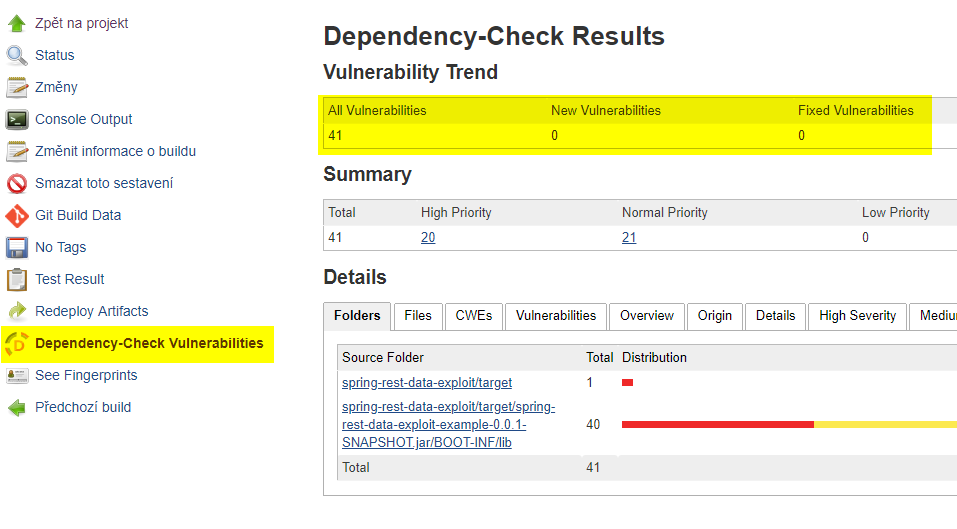

Have you ever image how many vulnerabilities exist in your applications since it was created? And how many of them comes from its dependencies?

The high secure environments require to perform regularly checks to discover any new vulnerability issue in your application. These checks can be done manually, but it may take a lot of time, especially if you are using the current frameworks (e.g. Spring Boot) with many and many transitive dependencies.

## The National Vulnerability Database 

[The National Vulnerability Database](https://nvd.nist.gov/) (NVM) is the U.S. government repository of standards-based vulnerabilities. Any vulnerability found in various software, hardware, databases, OS, and libraries gets its own id, e.g.: [CVE-2017-5753](https://nvd.nist.gov/vuln/detail/CVE-2017-5753) ([Meltdown](https://meltdownattack.com) bug).

Severity distribution of all found vulnerabilities over time shows the following figure:

For example, there is a high chance, that your application developed in 2016 has many potential vulnerabilities through its dependencies now, although you have used the current libraries at that time.

The connectivity between the NVM database and your application is provided by[the Open Web Application Security Project](https://www.owasp.org/index.php/Main_Page) (**OWASP,** a worldwide not-for-profit charitable organization focused on improving the security of software), especially one of its project [OWASP Dependency Check](https://www.owasp.org/index.php/OWASP_Dependency_Check). It offers a various way of scanning (a command line tool, Maven or Ant plugin etc.), but we will use the [Jenkins plugin](https://plugins.jenkins.io/dependency-check-jenkins-plugin) to integrate vulnerability scan into continuous integration process.

## Plugin Configuration

The plugin setup is very easy. I suppose that you already have a running instance of Jenkins server with your configured project inside. If not, you can quickly run Jenkins in [Docker](https://github.com/jenkinsci/docker), install [Dependency Check plugin](https://plugins.jenkins.io/dependency-check-jenkins-plugin) and import my example [project](https://github.com/pajikos/java-examples/tree/master/spring-rest-data-exploit) from GitHub with a really critical bug ([CVE-2017-8046](https://nvd.nist.gov/vuln/detail/CVE-2017-8046)) in [Spring Data Rest](https://pivotal.io/security/cve-2017-8046) (affected all version prior to version 2.6.9, fix released on November 27, 2017 but was in place from **2014!**, just to imagine, how it is important to regularly check your projects).

If you have imported your project in Jenkins, just add Invoke Dependency-Check analysis as a Post Step (for Pipeline project, check this [page](https://jenkins.io/doc/pipeline/steps/dependency-check-jenkins-plugin)):

## Test it

No special settings needed, it scans from the root of your project for all existing libraries in it. You can optionally check to Generate optional HTML report and Generate optional vulnerability report (HTML) to generate a summary about found vulnerabilities, here is my result (generated in Workspace root):

To integrate vulnerability scan into CI process, you can add a new Post-build Action Publish Dependency-Check results:

Here you can define your own Status thresholds, for example mark your build unstable if any high severity found in your project.

On the project page, you can find some statistics about found vulnerabilities in time:

It's all. You can see, performing a regular vulnerability scan does not cost much time and may prevent many attacks.
