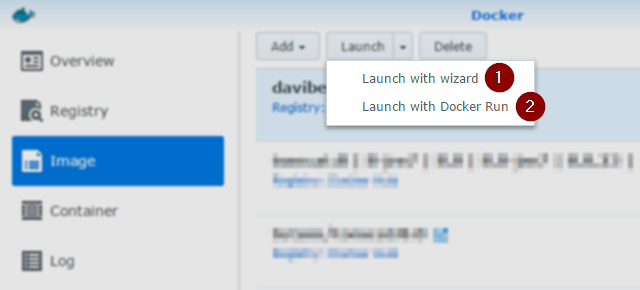
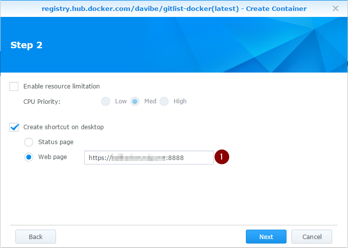
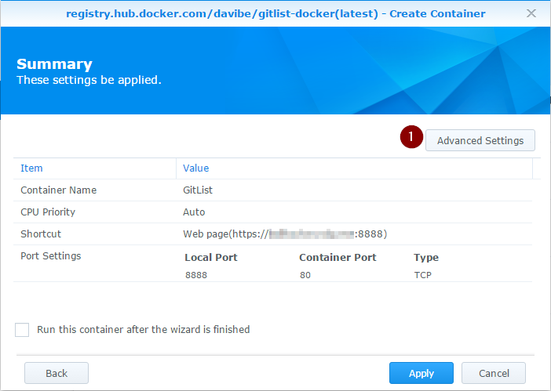
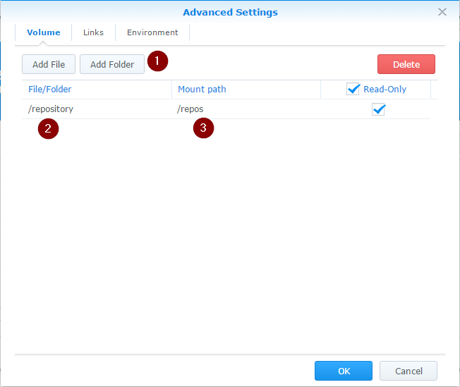
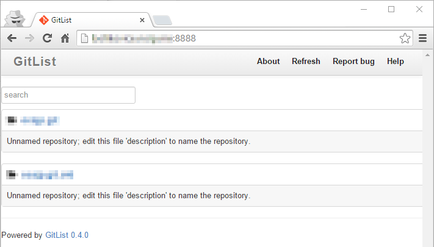

# How to Run Application in Docker on Synology


When you want to run your application in Docker on Synology you are not allowed to use all of [the available parameters](https://docs.docker.com/reference/run/) of the `docker run` command. Check [my other post](http://blog.pavelsklenar.com/how-to-install-and-use-docker-on-synology/) about basics with Docker on Synology which contains an enumeration of all possible parameters.

Basically, you have two options how to run your application in Docker.

1. Create your own original dockerfile including your application and build your new image.
2. Use one of existing images with some well-known applications (e.g. Jenkins, Gitlab, Wordpress etc.) available on [the official repository](https://registry.hub.docker.com/).

In any case, you will need to map some network ports to your new container and/or make possible to access some resources (e.g. Shared folders) from your Synology to your new container.

We will use a very simple application to demonstrate an overall deployment process. I chose [GitList](http://gitlist.org/), which is fully [available on the official hub](https://github.com/davibe/gitlist-docker).

The overall process consists of four steps:

## Download the GitList image to your Synology

Search for the keyword "GitList" on the Registry tab in the Docker application and download it. If you need more instructions, check [this](http://blog.pavelsklenar.com/how-to-install-and-use-docker-on-synology/).

## Find a required docker run command

You need to know a command how to run a downloaded application. You will usually find it [on the official page](https://github.com/davibe/gitlist-docker) of the downloaded image, in our case of the GitList:

```bash
docker run --rm=true -p 8888:80 -v /path/repo:/repos gitlist
```

Explaining of parameters:

<table class="aligncenter" border="1"><tbody><tr><td style="width: 150px;">&nbsp;<strong>--rm=true</strong></td><td>&nbsp;delete the current container immediately after the end of a run (useful in a case of no possible custom setting in the GitList, but Synology does not support that.</td></tr><tr><td style="width: 150px;">&nbsp;<strong>-p 8888:80</strong></td><td>&nbsp;GitList inside a Docker container is listening on port 80, but your Synology uses this port for another purpose. We will run our GitList on port 8888 (or whatever you want).</td></tr><tr><td style="width: 150px;"><strong>&nbsp;-v /path/repo:/repos</strong></td><td>&nbsp;The first part (/path/repo) will be a path on your Synology and /repos is a required path by GitList inside a container.</td></tr></tbody></table>

## Create a new container

Use the downloaded image for creating a new container with your application inside the Docker application on your Synology.

You may use either Launch with wizard **(1)** or Launch with Docker Run **(2)** options in the Launch menu on the Image tab:



There is no real difference between them, the second option tries to analyze your "docker run ..." command and automatically fills in the wizard, which appears after that as well.

We will use an empty wizard, set up the Container Name **(1)**, the Local Port **(2)** (your choice) and the Container Port **(3)** (must be 80):


On Step 2 we can create a shortcut on desktop **(1)** in DSM to the GitList homepage:



On the Summary page, open Advanced Settings **(1)** to map your folder with Git repositories to GitList:



Advanced Settings gives you an ability to **Add Folder (1)** placed on your Synology **(2)** and mount it to GitList **(3):** 


## Run it

After you started a new container (on the Container page), you may visit GitList in your browser through the IP assigned to Synology and using the port 8888:



The Docker application is quite deeply integrated into DSM, so you are able to configure an access to your application in the Firewall setting:


**NOTE:** GitList itself doesn't contain any user management or access restrictions, so enabling access to GitList outside of your network is not a good idea.

