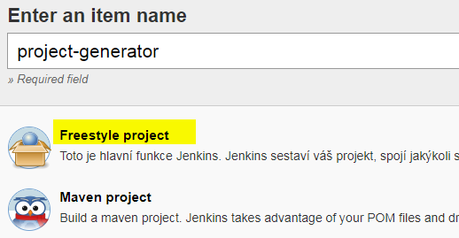
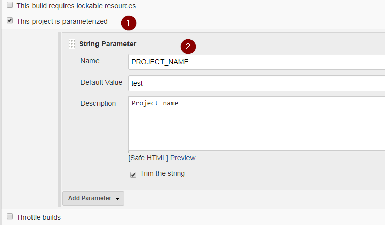

# Jenkins - Creating Dynamic Project Folders with Job DSL


This post is about the dynamic creating of project folders in Jenkins using Job DSL Plugin. The newly created project folders will be accessible by a specific group or user only, so you are able to use your Jenkins instance by multiple teams and each team will have their own folder for their projects.

Before we can start, the following plugins must be installed:

- [Matrix Authorization Strategy](https://plugins.jenkins.io/matrix-auth)
- [Job DSL Plugin](https://plugins.jenkins.io/job-dsl)

### Setting Up Correct Authorization Type

The first step is related to set up a correct authorization type in the Configure Global Security menu:


The menu Configure Global Security

Here you have to select the Project-based Matrix Authorization Strategy type and at least grant Overall/Read permission to Authenticated Users to enable login for all successfully authenticated users. Then you have to grant Administrator rights to you or any group.

If you skip the setting correct authorization type, folders will be created without any problems but the authorization setting will not be applied.

After that, we can create a Job DSL project.

### Creating Job DSL project

We need to create a Freestyle project (here the project-generator name):



Creating a new freestyle project

As our goal is about creating project folders, we create a new parameter using a checkbox "This project is parameterized". Then we add a new String parameter PROJECT\_NAME:



Adding a String Parameter to project-generator job

After that, the most important part is here. In the Build section, add build step and select Process Job DSLs:


and paste the following groovy script into the text field:

```groovy
def folderName = PROJECT_NAME.toUpperCase()
def adminGroup = "ROLE_${folderName}_ADMIN"
def opsGroup = "ROLE_${folderName}_READER"
folder(folderName) {
    displayName(folderName)
  description("Folder for project ${PROJECT_NAME} generated by ${JOB_NAME}")
    authorization {
        permissions(opsGroup, [
            'hudson.model.Item.Read',
            'hudson.model.Item.ViewStatus',
            'hudson.model.View.Read'
        ])
        permissionAll(adminGroup) 
    }
}
```

When we save the job and run Build with Parameters, the job will create a new folder based on the PROJECT\_NAME parameter (e.g. PROJECT1) and will be accessible by role ROLE\_PROJECT1\_ADMIN (as folder administrators with all permissions) and by role ROLE\_PROJECT1\_READER as job status readers.

The project-generator job page contains a list of created project folders:


List of all generated project folders

When we go to the PROJECT1 folder and into its configuration, you can check assigned rights. All available rights to assign are these:

- `com.cloudbees.plugins.credentials.CredentialsProvider.Create`
- `com.cloudbees.plugins.credentials.CredentialsProvider.Delete`
- `com.cloudbees.plugins.credentials.CredentialsProvider.ManageDomains`
- `com.cloudbees.plugins.credentials.CredentialsProvider.Update`
- `com.cloudbees.plugins.credentials.CredentialsProvider.View`
- `hudson.model.Item.Build`
- `hudson.model.Item.Cancel`
- `hudson.model.Item.Configure`
- `hudson.model.Item.Create`
- `hudson.model.Item.Delete`
- `hudson.model.Item.Discover`
- `hudson.model.Item.Move`
- `hudson.model.Item.Read`
- `hudson.model.Item.Release`
- `hudson.model.Item.ViewStatus`
- `hudson.model.Item.Workspace`
- `hudson.model.Run.Delete`
- `hudson.model.Run.Replay`
- `hudson.model.Run.Update`
- `hudson.model.View.Configure`
- `hudson.model.View.Create`
- `hudson.model.View.Delete`
- `hudson.model.View.Read`
- `hudson.scm.SCM.Tag`

When you try to login with user-defined in role e.g. ROLE\_PROJECT1\_ADMIN, you will see your folders only:


### Integration Jenkins with Remote Systems

If you need to integrate your job (i.e. project-generator) with some 3rd party systems as a final step of any approval process (e.g. in Jira), you may use Jenkins remote API to run our job.

Before that, you need to generate a token to be used in the authentication during the call Jenkins API. You are able to generate a new token in the configuration page of any user:


Now you can make a call with curl from the command line (replace TOKEN string by your own token, JENKINS\_URL by your Jenkins URL, USER by related username and JOB\_NAME by e.g. project-generator):

Option 1 (using form-data):

```bash
curl -X POST JENKINS_URL/job/JOB_NAME/build \
  --user USER:TOKEN \
  --form json='{"parameter": [{"name":"PROJECT_NAME", "value":"PROJECT2"}]}'
```
Option 2 (using get parameters):
```bash
curl -X POST JENKINS_URL/job/JOB_NAME/buildWithParameters?PROJECT_NAME=PROJECT2 \
  --user USER:TOKEN
```
The job will be executed with the project name parameter and now your Jenkins is ready for a new project and its own CI/CD build jobs.

