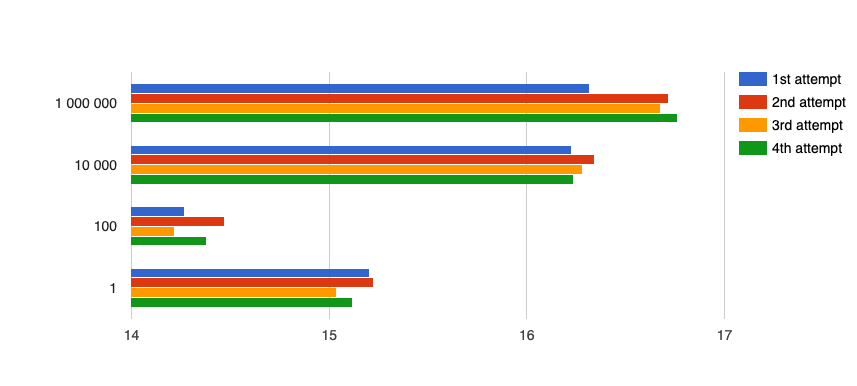
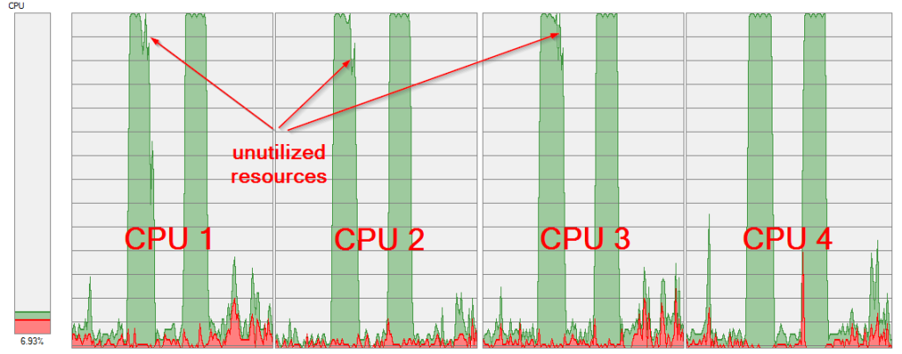

# Parallel Processing in Java


This post shows how to implement parallelism in Java using its native  `java.util.concurrent` classes.

I mean especially using parallel Fork-Join Framework (available since Java 1.7), which is most suitable for processing of high complex (CPU intensive) tasks. I mean that case when you have one very complex task and you want to use all of your available computing resources to process your single task in the fastest time.

The basic idea of the Fork-Join Framework concerns "Divide and Conquer". You need to split a big task up into enough subtasks to keep all of your CPUs utilized. You have no limit how many times you subdivide a task but be aware that a subdividing adds some overhead as well. It can be a little hard to determine the number of subtasks. I will discuss it later with a benchmark example.

The Fork-Join Framework offers two basic abstract tasks: [RecursiveAction](https://docs.oracle.com/javase/7/docs/api/java/util/concurrent/RecursiveAction.html) and [RecursiveTask.](https://docs.oracle.com/javase/7/docs/api/java/util/concurrent/RecursiveTask.html)

The basic difference is related to its return value. [RecursiveTask](https://docs.oracle.com/javase/7/docs/api/java/util/concurrent/RecursiveTask.html) is appropriate when you need to return a result from your task, e.g. sorting a really huge array. A result of each subtask needs to be compared with each other. This task is a little bit harder to code.

[RecursiveAction](https://docs.oracle.com/javase/7/docs/api/java/util/concurrent/RecursiveAction.html) does not return any result, you can use it e.g. to initialize a big array with some custom values. Each of subtask works alone on its own piece of that array.

## How to choose an appropriate big task

I would like to make a benchmark with a parallel processing, so I need to choose a really CPU intensive task. The opposite - I/O intensive tasks are not clear because you may not see any performance benefits using parallelism, e.g. processing of a big file from a file system, where you can suffer from reading to slow from your disc.

I've chosen a computation of all prime numbers up to a defined limit. This post is not about choosing the best and most efficient algorithm to check whether a number is prime or not, but I have used a little bit optimized way to check a number is prime (inspired by [Javin Paul's blog page](http://java67.blogspot.cz/2014/01/how-to-check-if-given-number-is-prime.html)):

```java
public static boolean isPrime(int num) {
    if (num == 2 || num == 3) {
        return true;
    }
    if (num % 2 == 0 || num % 3 == 0) {
        return false;
    }
    for (int i = 3; i <= Math.sqrt(num); i += 2) {
        if (num % i == 0) {
            return false;
        }
    }
    return true;
}
```

Basically, it consists of testing whether a num variable is multiple of any integer between 2 and sqrt{n} with some improvements, e.g. skipping even numbers.

## How to create RecursiveAction

In a case you want to implement a `RecursiveAction`, you need to create your own class which extends from `java.util.concurrent.RecursiveAction` (which is actually an abstract class) and implement it's abstract method `compute():`
```java
class PrimeRecursiveAction extends RecursiveAction {
 
    private int threshold;
    private Set<Integer> data;
    private int start;
    private int end;
 
    public PrimeRecursiveAction(Set<Integer> data, int start, int end,
            int threshold) {
        this.data = data;
        this.start = start; // start to process from
        this.end = end; // end of processing
        this.threshold = threshold;
    }
     
    @Override
    protected void compute() {
        if (end - start <= threshold) { // Am I able to process it alone?
            // do the task
            for (int i = start; i < end; i++) {
                if (PrimeNumberUtil.isPrime(i)) {
                    data.add(i);
                }
            }
        } else { // split too big task
            int halfAmount = ((end - start) / 2) + start;
            PrimeRecursiveAction leftTask = new PrimeRecursiveAction(data,
                    start, halfAmount, threshold);
            leftTask.fork(); // add left task to the queue
            PrimeRecursiveAction rightTask = new PrimeRecursiveAction(data,
                    halfAmount, end, threshold);
            rightTask.compute(); // work on right task, this is a recursive call
            leftTask.join(); // wait for queued task to be completed
        }
    }
}
```
The following method calls are very important: `compute(), fork(),` and `join().`

### Compute()

As I said before, the main part to be coded is a decision how many levels of recursion are appropriate (i.e. the first condition including the `threshold` variable).

The main question is: Am I able to process it alone?

When you call `compute()` on the `rightTask` actually you are doing a recursive call.

### Fork()

With the Fork-Join Framework, each thread in the `ForkJoinPool` has a queue of the tasks it is working on. The calling of `fork()` method places our newly created `PrimeRecursiveAction` in the current thread's task queue. A key feature of the Fork-Join Framework is work (task) stealing. Stealing means that the other free threads in a ForkJoinPool (if any) may take and process these tasks.

### Join()

When you call `join()` on the left (previously forked) task, it should be one of the last steps after calling `fork()` and `compute()`. Calling `join()` means that "I can't continue unless this (left) task is done." But calling `join()` is not only about waiting.

The task you call `join()` on can still be in the queue (not stolen). In this case, the thread calling `join()` will execute the joined task.

To simplify you can replace lines with calling `fork()`, `compute()` and `join()` with the following call `invokeAll(rightTask, leftTask)`. Using that will also help you to avoid possible bugs with calling fork-compute-join methods in the correct order - just for completeness.

## How to call your own RecursiveAction

You need to create a new instance of your `RecursiveAction` implementation (i.e. `PrimeRecursiveAction` in our case) and invoke it using `ForkJoinPool`. The `class java.util.concurrent.ForkJoinPool` is a highly specialized `ExecutorService` which takes in a case of no-arg `ForkJoinPool` constructor creates an instance that will use the `Runtime.availableProcessors()` method to determine the level of parallelism. It exists also a  `ForkJoinPool(int parallelism)` constructor that allows you to set the number of threads that will be used to process your task.

```java
Set<Integer> data = new ConcurrentSkipListSet<Integer>();
ForkJoinPool fjPool = new ForkJoinPool()
PrimeRecursiveAction action = new PrimeRecursiveAction(data, 0, 100, 5);
fjPool.invoke(action);
```

The constructor of the `PrimeRecursiveAction` needs an instance `Set` of `Integers` (to save prime numbers), a search interval to find prime numbers (we are looking for prime numbers from 0 to 100 now) and a `threshold` value.

As you may have noticed, I had used a new instance of an ordered `[ConcurrentSkipListSet](https://docs.oracle.com/javase/7/docs/api/java/util/concurrent/ConcurrentSkipListSet.html).` This implementation is based on a [`ConcurrentSkipListMap`](https://docs.oracle.com/javase/7/docs/api/java/util/concurrent/ConcurrentSkipListMap.html "class in java.util.concurrent") and its concurrency support is required because multiple threads are adding values concurrently. When you do not need natural order sorting, you can use a `Set` based on a faster `[ConcurrentHashMap](https://docs.oracle.com/javase/7/docs/api/java/util/concurrent/ConcurrentHashMap.html)` (`ConcurrentHashMap.newKeySet()`).

## Performance test

The decision how many levels of recursion are appropriate is one of the most important things that you need to do. You need to create enough subtasks that you keep all of your CPUs utilized all the time of the whole processing.

I made a benchmark to find out the right size of the subtask, i.e. the `threshold` value. I mean the state when the current thread does not need to create another subtask anymore and is able to start checking whether a number is prime or not in its interval.

### The rules of the game number ONE

There are many factors that can influence the appropriate `threshold` value. You have to take into account number of parallelism you have available. The decision about processing a task alone or creating other recursion calls including a management of the task queue consume your resources as well.

When you creates too many subtasks, your task queue management consumes too many resources. On the other hand, a large `threshold` value does not keep utilized all of your CPUs at the same time. Some threads become free (no other tasks to process in the queue), but another thread might be still processing its big task.

All of this vary on the amount of the required work, i.e. the upper limit where the application stops to search for prime numbers.

So this my starting point:

<table><tbody><tr><td><strong>Available parallelism:</strong></td><td>4</td></tr><tr><td><strong>The upper limit of the search:</strong></td><td>30 000 000 (this value has no special meaning, I just needed a big task, but no too big :))</td></tr><tr><td><strong>Threshold values to test:</strong></td><td>1, 100, 10 000, 1 000 000 (i.e. 4 variants)</td></tr><tr><td><strong>Number of attempts for each&nbsp;variant:</strong></td><td>4, (actually 6, but the worst and the best result will be skipped)</td></tr></tbody></table>

The Graph 1 shows my benchmark result. The x-axis is a time in seconds, the y-axis is the threshold value used in the each test.



As you can see the most appropriate threshold value is 100 in my case (4 available threads and the limit of the search equals to 30 000 000).

In a case of the large threshold (1 000 000), one CPU was still processing its task, but other CPUs have already processed rest of tasks. See my CPU load, the first attempt is with threshold 1 000 000, the second one with threshold 100:



The reason for the low performance in a case of large threshold values is clear.

The threshold value 1 was slower than 100, but why? The most probable reason is too many recursions calls created during processing. See the following statistic:

<table><tbody><tr><td><strong>The upper limit of the search</strong></td><td><strong>Threshold values</strong></td><td><strong>The number of all created tasks during processing</strong></td></tr><tr><td>&nbsp;30 000 000</td><td>1</td><td>59 999 999</td></tr><tr><td>&nbsp;30 000 000</td><td>&nbsp;100</td><td>1 048 575</td></tr><tr><td>30 000 000</td><td>10 000</td><td>8 191</td></tr><tr><td>30 000 000</td><td>1 000 000</td><td>63</td></tr></tbody></table>

### The rules of the game number TWO

In the previous test, we found that the most appropriate threshold value is 100 (in a case of the upper limit of the search 30 millions).

I would like to know the gain of using parallel processing. I will test each of available levels of parallelism, i.e. 1-4 (on my PC) with the `RecursiveAction`. At the end, I will try to process the task without the `RecursviceAction`, simply without creating any subtasks, recursive calls and dividing intervals. Of cause, the last test will be processed by one thread only.

So this my starting point:

<table><tbody><tr><td><strong>Number of available parallelisms to test:</strong></td><td>1-4 using ForkJoinPool and RecursiveAction, 1 using simple processing &nbsp; (i.e. 5 variants)</td></tr><tr><td><strong>The upper limit of the search:</strong></td><td>30 000 000 (this value has no special meaning, I just needed a big task, but no too big :))</td></tr><tr><td><strong>Threshold value:</strong></td><td>100</td></tr><tr><td><strong>Number of attempts for each&nbsp;variant:</strong></td><td>4, (actually 6, but the worst and the best result will be skipped)</td></tr></tbody></table>

Here is the result, the x-axis is a time in seconds, the y-axis is the level of parallelism used in the each test.


As you can see, the benefit of higher parallelism level is obvious, but it does not mean, that the half number of available thread means twice as much time to process the same amount of work.

There is another interesting fact about difference between using ForkJoinPool with RecursiveAction and using a simple processing algorithm (using a for cycle, for more information, check the code on my [GitHub](https://github.com/pajikos/RecursiveActionExample)). I had suspected that the management about the queuing newly created tasks would lead to longer time in processing.  The measured results do not show any difference between these two options. The overhead in management is probably not so huge to affect the result.

## Summary

The Fork-Join Framework is very easy to implement by using `ForkJoinPool` and its `RecursiveAction` task.

On the other hand, you have to consider whether your task is appropriate for parallel processing. If it is, you have to tune in the correct parameters (e.g. the threshold value, a level of parallelism etc.), otherwise your result will be worse than another simpler solution without using the Fork-Join Framework.

