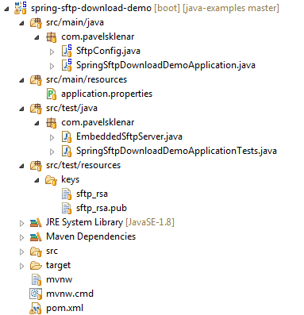

# Spring Integration: SFTP Download using Key-Based Authentication


This example will demonstrate how to use Spring Integration for downloading files from a remote SFTP server. Two possible authentications could be used, i.e. public key or password.

Technologies used:

1. Spring Boot 2.0.4.RELEASE
2. Spring Integration 5.0.7.RELEASE (managed by Spring Boot)
3. Spring 5.0.8.RELEASE (managed by Spring Boot)

Quick overview:

1. Create SFTP Session Factory, i.e. `DefaultSftpSessionFactory`
2. Create and set up `InboundChannelAdapter` to regularly check a remote SFTP server for new files
3. Create `MessageHandler` to process incoming files

## Project Structure



## SftpConfig using Java Configuration

We have to configure SFTP Session Factory (`DefaultSftpSessionFactory`) with all required parameters, i.e. host, IP port, username and password (or private key with a passphrase). The same configuration was already used in the [SFTP Upload Example.](https://blog.pavelsklenar.com/spring-integration-sftp-upload-example/)

After that, we have to create a `MessageSource<File>` bean and define it as a @`InboundChannelAdapter.` This component is responsible for regularly checking a remote SFTP server whether a new file exists. A regular period defines annotation `@Poller` inside definition of `InboundChannelAdapter` (`Poller` is defined by the cron expression).

Then, we need to create an instance of a `SftpInboundFileSynchronizer` (will be used by `@InboundChannelAdapter)`, which defines a strategy of a synchronization mechanism, i.e. we are able to set remote filename filters (`sftpRemoteDirectoryDownloadFilter`), a remote directory path (`sftpRemoteDirectoryDownload`) or whether a remote file should be deleted after a successful transfer.

The last important bean is related to a general `MessageHandler` bean used as a `@ServiceActivator. The MessageHandler` processes incoming files.

```java
@Configuration
public class SftpConfig {
 
    @Value("${sftp.host}")
    private String sftpHost;
 
    @Value("${sftp.port:22}")
    private int sftpPort;
 
    @Value("${sftp.user}")
    private String sftpUser;
 
    @Value("${sftp.privateKey:#{null}}")
    private Resource sftpPrivateKey;
 
    @Value("${sftp.privateKeyPassphrase:}")
    private String sftpPrivateKeyPassphrase;
 
    @Value("${sftp.password:#{null}}")
    private String sftpPasword;
 
    @Value("${sftp.remote.directory.download:/}")
    private String sftpRemoteDirectoryDownload;
 
    @Value("${sftp.local.directory.download:${java.io.tmpdir}/localDownload}")
    private String sftpLocalDirectoryDownload;
 
    @Value("${sftp.remote.directory.download.filter:*.*}")
    private String sftpRemoteDirectoryDownloadFilter;
 
    @Bean
    public SessionFactory<LsEntry> sftpSessionFactory() {
        DefaultSftpSessionFactory factory = new DefaultSftpSessionFactory(true);
        factory.setHost(sftpHost);
        factory.setPort(sftpPort);
        factory.setUser(sftpUser);
        if (sftpPrivateKey != null) {
            factory.setPrivateKey(sftpPrivateKey);
            factory.setPrivateKeyPassphrase(sftpPrivateKeyPassphrase);
        } else {
            factory.setPassword(sftpPasword);
        }
        factory.setAllowUnknownKeys(true);
        return new CachingSessionFactory<LsEntry>(factory);
    }
 
    @Bean
    public SftpInboundFileSynchronizer sftpInboundFileSynchronizer() {
        SftpInboundFileSynchronizer fileSynchronizer = new SftpInboundFileSynchronizer(sftpSessionFactory());
        fileSynchronizer.setDeleteRemoteFiles(true);
        fileSynchronizer.setRemoteDirectory(sftpRemoteDirectoryDownload);
        fileSynchronizer
                .setFilter(new SftpSimplePatternFileListFilter(sftpRemoteDirectoryDownloadFilter));
        return fileSynchronizer;
    }
 
    @Bean
    @InboundChannelAdapter(channel = "fromSftpChannel", poller = @Poller(cron = "0/5 * * * * *"))
    public MessageSource<File> sftpMessageSource() {
        SftpInboundFileSynchronizingMessageSource source = new SftpInboundFileSynchronizingMessageSource(
                sftpInboundFileSynchronizer());
        source.setLocalDirectory(new File(sftpLocalDirectoryDownload));
        source.setAutoCreateLocalDirectory(true);
        source.setLocalFilter(new AcceptOnceFileListFilter<File>());
        return source;
    }
 
    @Bean
    @ServiceActivator(inputChannel = "fromSftpChannel")
    public MessageHandler resultFileHandler() {
        return new MessageHandler() {
            @Override
            public void handleMessage(Message<?> message) throws MessagingException {
                System.err.println(message.getPayload());
            }
        };
    }
}
```

## Setup Spring Boot with Spring Integration

I have used Spring Boot in my example, so annotation `@SpringBootApplication` is obvious. The more interesting annotation is `@IntegrationComponentScan` and `@EnableIntegration` which will enable all other configurations used in the previous configuration file.

```java
@SpringBootApplication
@IntegrationComponentScan
@EnableIntegration
public class SpringSftpDownloadDemoApplication {
 
    public static void main(String[] args) {
        SpringApplication.run(SpringSftpDownloadDemoApplication.class, args);
    }
}
```

## Example of Usage

Here you can see a basic use case. I have created an integration test using a real SFTP server with enabled public key authentication (i.e. without password). This test starts an asynchronous thread to check an existence of a downloaded file.

```java
@RunWith(SpringRunner.class)
@SpringBootTest
@TestPropertySource(properties = { "sftp.port = 10022", "sftp.remote.directory.download.filter=*.xxx"})
public class SpringSftpDownloadDemoApplicationTests {
 
    private static EmbeddedSftpServer server;
 
    private static Path sftpFolder;
 
    @Value("${sftp.local.directory.download}")
    private String localDirectoryDownload;
 
 
    @BeforeClass
    public static void startServer() throws Exception {
        server = new EmbeddedSftpServer();
        server.setPort(10022);
        sftpFolder = Files.createTempDirectory("SFTP_DOWNLOAD_TEST");
        server.afterPropertiesSet();
        server.setHomeFolder(sftpFolder);
        // Starting SFTP
        if (!server.isRunning()) {
            server.start();
        }
    }
 
    @Before
    @After
    public void clean() throws IOException {
        Files.walk(Paths.get(localDirectoryDownload)).filter(Files::isRegularFile).map(Path::toFile)
                .forEach(File::delete);
    }
 
    @Test
    public void testDownload() throws IOException, InterruptedException, ExecutionException, TimeoutException {
        // Prepare phase
        Path tempFile = Files.createTempFile(sftpFolder, "TEST_DOWNLOAD_", ".xxx");
 
        // Run async task to wait for expected files to be downloaded to a file
        // system from a remote SFTP server
        Future<Boolean> future = Executors.newSingleThreadExecutor().submit(new Callable<Boolean>() {
            @Override
            public Boolean call() throws Exception {
                Path expectedFile = Paths.get(localDirectoryDownload).resolve(tempFile.getFileName());
                while (!Files.exists(expectedFile)) {
                    Thread.sleep(200);
                }
                return true;
            }
        });
 
        // Validation phase
        assertTrue(future.get(10, TimeUnit.SECONDS));
        assertTrue(Files.notExists(tempFile));
    }
 
    @AfterClass
    public static void stopServer() {
        if (server.isRunning()) {
            server.stop();
        }
    }
}
```

The source code of this project could be found on my public [Github profile](https://github.com/pajikos/java-examples/tree/master/spring-sftp-download-demo).

