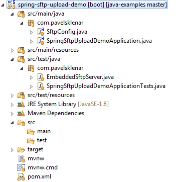

# Spring Integration: SFTP Upload Example using Key-Based Authentication


This example will demonstrate how to use Spring Integration for uploading files to a remote SFTP server. You can use both of possible authentication methods, i.e. with a public key or with a password. The real example shows the public key authentication only because it is a more production-ready choice.

Technologies used:

1. Spring Boot 2.0.4.RELEASE
2. Spring Integration 5.0.7.RELEASE (managed by Spring Boot)
3. Spring 5.0.8.RELEASE (managed by Spring Boot)

Quick overview:

1. Create SFTP Session Factory, i.e. `DefaultSftpSessionFactory`
2. Create and setup `SftpMessageHandler`
3. Create `UploadGateway` as an entry point to upload any file

## Project Structure

A final project directory structure. [](https://blog.pavelsklenar.com/wp-content/uploads/2017/04/Spring-spring-sftp-upload-demo_src_main_java_com_pavelsklenar_SftpConf.png)

## SftpConfig using Java Configuration

We have to configure SFTP Session Factory (`DefaultSftpSessionFactory`) with all required parameters, i.e. host, IP port, username and password (or private key with a passphrase).

After that, we have to configure an appropriate `MessageHandler`, i.e. `SftpMessageHandler` in our case. It is responsible for uploading any incoming file to a remote SFTP server, so we must provide a remote directory path and a filename to be used on a remote server.

`MessageHandler` is a part of the Spring Integration, so we have to create a gateway between Spring Integration world (i.e. a world using channels, channel subscribers etc.) and the well-known world of simple beans. So the following annotation `MessagingGateway` on the interface `UploadGateway` will create a simple bean possible to be used anywhere you want to upload a file by calling upload method only.

```java
@Configuration
public class SftpConfig {
 
    @Value("${sftp.host}")
    private String sftpHost;
 
    @Value("${sftp.port:22}")
    private int sftpPort;
 
    @Value("${sftp.user}")
    private String sftpUser;
 
    @Value("${sftp.privateKey:#{null}}")
    private Resource sftpPrivateKey;
 
    @Value("${sftp.privateKeyPassphrase:}")
    private String sftpPrivateKeyPassphrase;
 
    @Value("${sftp.password:#{null}}")
    private String sftpPasword;
 
    @Value("${sftp.remote.directory:/}")
    private String sftpRemoteDirectory;
 
    @Bean
    public SessionFactory<LsEntry> sftpSessionFactory() {
        DefaultSftpSessionFactory factory = new DefaultSftpSessionFactory(true);
        factory.setHost(sftpHost);
        factory.setPort(sftpPort);
        factory.setUser(sftpUser);
        if (sftpPrivateKey != null) {
            factory.setPrivateKey(sftpPrivateKey);
            factory.setPrivateKeyPassphrase(sftpPrivateKeyPassphrase);
        } else {
            factory.setPassword(sftpPasword);
        }
        factory.setAllowUnknownKeys(true);
        return new CachingSessionFactory<LsEntry>(factory);
    }
 
    @Bean
    @ServiceActivator(inputChannel = "toSftpChannel")
    public MessageHandler handler() {
        SftpMessageHandler handler = new SftpMessageHandler(sftpSessionFactory());
        handler.setRemoteDirectoryExpression(new LiteralExpression(sftpRemoteDirectory));
        handler.setFileNameGenerator(new FileNameGenerator() {
            @Override
            public String generateFileName(Message<?> message) {
                if (message.getPayload() instanceof File) {
                    return ((File) message.getPayload()).getName();
                } else {
                    throw new IllegalArgumentException("File expected as payload.");
                }
            }
        });
        return handler;
    }
 
    @MessagingGateway
    public interface UploadGateway {
 
        @Gateway(requestChannel = "toSftpChannel")
        void upload(File file);
 
    }
}
```

## Setup Spring Boot with Spring Integration

I have used Spring Boot in my example, so annotation `@SpringBootApplication` is obvious. The more interesting annotation is `@IntegrationComponentScan` and `@EnableIntegration` which will enable all other configurations used in the previous configuration file.

```java
@SpringBootApplication
@IntegrationComponentScan
@EnableIntegration
public class SpringSftpUploadDemoApplication {
 
    public static void main(String[] args) {
        SpringApplication.run(SpringSftpUploadDemoApplication.class, args);
    }
}
```

## Example of Usage

Here you can see a basic usage of our `UploadGateway`. I have created an integration test using a real SFTP server with enabled public key authentication (i.e. without password).

```java
@RunWith(SpringRunner.class)
@SpringBootTest
@TestPropertySource(properties = { "sftp.port = 10022" })
public class SpringSftpUploadDemoApplicationTests {
 
    @Autowired
    private UploadGateway gateway;
 
    private static EmbeddedSftpServer server;
 
    private static Path sftpFolder;
 
    @BeforeClass
    public static void startServer() throws Exception {
        server = new EmbeddedSftpServer();
        server.setPort(10022);
        sftpFolder = Files.createTempDirectory("SFTP_UPLOAD_TEST");
        server.afterPropertiesSet();
        server.setHomeFolder(sftpFolder);
        // Starting SFTP
        if (!server.isRunning()) {
            server.start();
        }
    }
 
    @Before
    @After
    public void cleanSftpFolder() throws IOException {
        Files.walk(sftpFolder).filter(Files::isRegularFile).map(Path::toFile).forEach(File::delete);
    }
 
    @Test
    public void testUpload() throws IOException {
        // Prepare phase
        Path tempFile = Files.createTempFile("UPLOAD_TEST", ".csv");
 
        // Prerequisites
        assertEquals(0, Files.list(sftpFolder).count());
 
        // test phase
        gateway.upload(tempFile.toFile());
 
        // Validation phase
        List<Path> paths = Files.list(sftpFolder).collect(Collectors.toList());
        assertEquals(1, paths.size());
        assertEquals(tempFile.getFileName(), paths.get(0).getFileName());
    }
 
    @AfterClass
    public static void stopServer() {
        if (server.isRunning()) {
            server.stop();
        }
    }
}
```

The source code of this project could be found on my public [Github profile](https://github.com/pajikos/java-examples/tree/master/spring-sftp-upload-demo).

