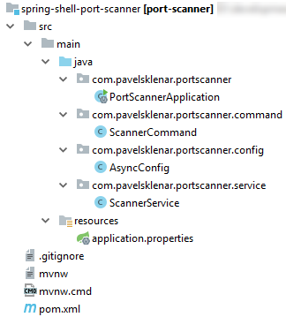

# TCP Port Scanner Example using Spring Shell


This post is about using Spring Shell to make a simple application for scanning open TCP ports.

Technologies used:

1. Spring Boot 2.0.5.RELEASE
2. Spring Shell 2.0.1.RELEASE

Quick Overview:

1. Final Project Structure
2. Creating a new base Spring Boot project
3. Needs for parallelism
4. How check whether a port is open?
5. Integrating with Spring Shell
6. How it works

## Final Project Structure



## Creating a new base Spring Boot project

We will start with a new project generated by [Spring Initializr](https://start.spring.io/). We need just only one Spring dependency, i.e. Spring Shell.

All required dependencies are shown here:

```xml
<dependencies>
        <dependency>
            <groupId>org.springframework.shell</groupId>
            <artifactId>spring-shell-starter</artifactId>
            <version>2.0.1.RELEASE</version>
        </dependency>
</dependencies>
```
## Needs for parallelism

Scanning open ports can take a lot of time, especially when you are scanning thousands of ports. It is clear we need to parallel this task. The level of the parallelism can be defined with a number of possible threads inside our thread pool (just to be sure, we will use async support from Spring):

```java
@Configuration
@EnableAsync
public class AsyncConfig implements AsyncConfigurer {
 
    @Value("${threads.count:20}")
    private int threadsCount;
 
    @Override
    public Executor getAsyncExecutor() {
        return Executors.newFixedThreadPool(threadsCount);
    }
}
```
## How check whether a port is open?

Each of tries to check whether a port is open will contain the same step, i.e. a connect using `java.net.Socket` to a specific IP address and a specific port. When a connection timeout occurs a port is not open. Take notice that our method is annotated with `@Async` and return type is `Future`.

It means that everyone who calls this method will not be blocked until the end of a scanning process. In other words, this method starts running in another thread than the caller's thread.

```java
@Async
public Future<ScanResult> checkPort(String ip, int port) {
        try {
            Socket socket = new Socket();
            socket.connect(new InetSocketAddress(ip, port), timeout);
            socket.close();
            return new AsyncResult<>(new ScanResult(port, true));
        } catch (IOException ex) {
            return new AsyncResult<>(new ScanResult(port, false));
        }
}
```
## Integrating with Spring Shell

Our goal is to create an application which will be able to scan open ports on a specific IP address. So it would be fine to create a command line application and Spring Shell will help us to do that.

At first, we need to create a new command so we will create a new class. Each of a method it will be a standalone command callable from a command line. The Spring Shell just only needs to know about this class and so-called method commands.

All of this can be configured using annotations: `@ShellComponent` on a class level and `@ShellMethod` on a method level. Command parameters are the same as method parameters with the possibility to customize it using `@ShellOption`.

Here is our implementation. First of all, we create a task for each of port to scan (calling method `addToScan`) and then we print a result to an output.

There is some magic to be able to scan either a single port or range of ports:

```java
@ShellComponent
public class ScannerCommand {
 
    public static final String PORT_SEPARATOR = "-";
    private final ScannerService scannerService;
 
    @Autowired
    public ScannerCommand(ScannerService scannerService) {
        this.scannerService = scannerService;
    }
 
    @ShellMethod(value = "Scan open ports for a specific IP address")
    public String scan(
            @ShellOption(help = "IP address") String ip,
            @ShellOption(help = "Port or port range, e.g. 1-1024") String port,
            @ShellOption(help = "Weather only open ports should be displayed") boolean displayOnlyOpen
    ) throws ExecutionException, InterruptedException {
        //Add all required ports into port scanner
        List<Future<ScannerService.ScanResult>> futureList;
        if (port.contains(PORT_SEPARATOR)) {
            String[] rangeLimits = port.split(PORT_SEPARATOR);
            futureList = addToScan(ip, range(Integer.parseInt(rangeLimits[0]), Integer.parseInt(rangeLimits[1])));
        } else {
            futureList = addToScan(ip, Integer.parseInt(port));
        }
 
        //Read and write results
        for (final Future<ScannerService.ScanResult> scanResultFuture : futureList) {
            ScannerService.ScanResult scanResult = scanResultFuture.get();
            if (displayOnlyOpen) {
                if (scanResult.isOpen()) {
                    System.out.println(scanResult);
                }
            } else {
                System.out.println(scanResult);
            }
        }
 
        return "DONE";
    }
 
    private List<Future<ScannerService.ScanResult>> addToScan(String ip, int... ports) {
        List<Future<ScannerService.ScanResult>> result = new ArrayList<>();
        for (int port : ports) {
            result.add(scannerService.checkPort(ip, port));
        }
        return result;
    }
}
```

## How it works

When you successfully run our application, you will see a command line prompt:
```bash
shell:>
```
You can use some predefined command such a help with our scan command:
```bash
shell:> help scan
 
 
NAME
    scan - Scan open ports for a specific IP address
 
SYNOPSYS
    scan [--ip] string  [--port] string  [--display-only-open] 
 
OPTIONS
    --ip  string
        IP address
        [Mandatory]
 
    --port  string
        Port or port range, e.g. 1-1024
        [Mandatory]
 
    --display-only-open Weather only open ports should be displayed
        [Optional, default = false]

```

So let's try our command with the option --display-only-open to display open ports only:
```bash
shell:>scan --ip 10.15.13.52 --port 1-1024 --display-only-open
port 22 - open
port 25 - open
DONE
```

You can find all source codes on [my GitHub profile](https://github.com/pajikos/java-examples/tree/master/spring-shell-port-scanner).

Some useful links about this topic:

- [How To Do @Async in Spring](https://www.baeldung.com/spring-async)
- [Spring Shell Reference Documentation](https://docs.spring.io/spring-shell/docs/current/reference/htmlsingle/)

